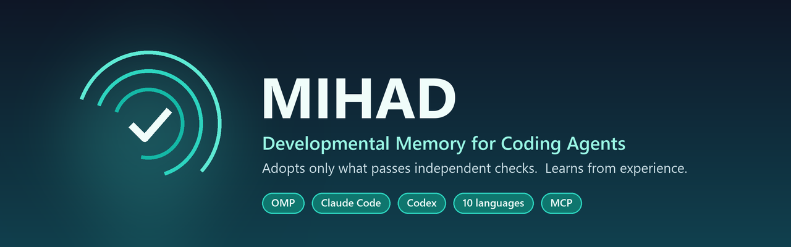
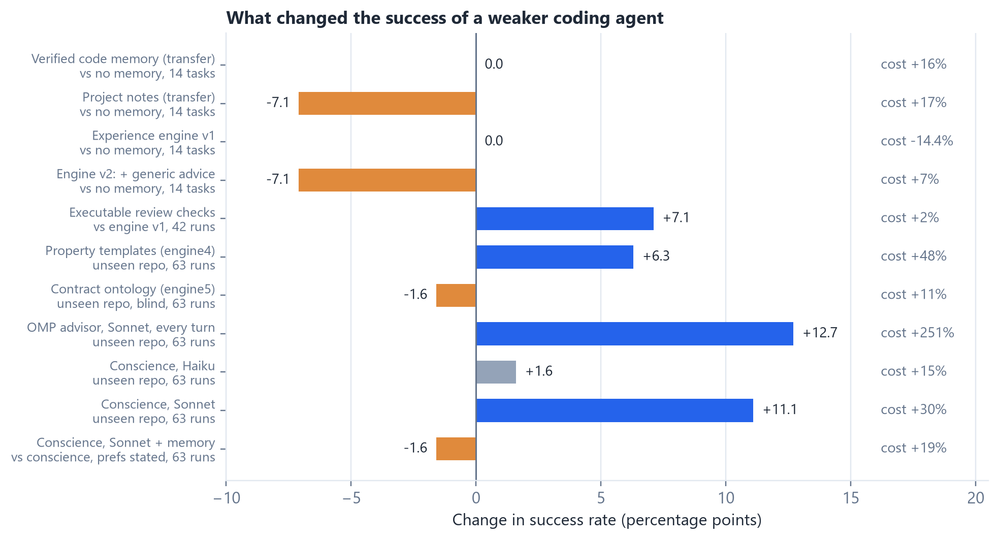
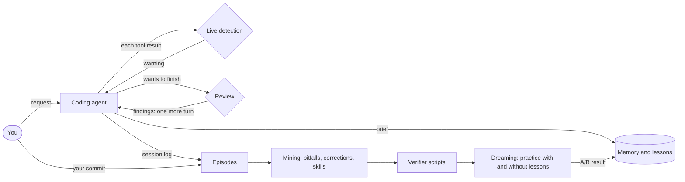

<p align="center">
  
</p>

<p align="center">
  <a href="LICENSE"></a>
  
  
  
  
  
</p>

<p align="center">
  <a href="#-why-mihad">Why</a> •
  <a href="#-what-it-does">Features</a> •
  <a href="#-what-the-experiments-showed">Results</a> •
  <a href="#-quick-start">Quick start</a> •
  <a href="#-how-it-works">How it works</a> •
  <a href="#-documentation">Docs</a> •
  <a href="paper/MIHAD_Research_Paper_EN_v2.2.md">Paper</a> •
  <a href="#-بالعربية">العربية</a>
</p>

---

## 💡 Why MIHAD

Coding agents start every session like a new hire on day one. They forget yesterday's corrections and repeat the same mistakes. Saving everything they "learn" is not the answer either: an agent that remembers its own wrong conclusions repeats them with confidence.

**MIHAD gives an agent a memory and a body of experience that grow with use, and it adopts nothing without independent evidence.** It is built on a research programme with pinned protocols, real repository history and a blind quality judge. See the [paper](paper/MIHAD_Research_Paper_EN_v2.2.md).

## ✨ What it does

<table>
<tr>
<td width="50%" valign="top">

### 🛡️ Verified memory
A skill must pass your project's own tests. A fact must quote the code as it was before the session. A preference must be your own words. Everything else stays provisional, and corrections reach everything built on an item.

</td>
<td width="50%" valign="top">

### 🗣️ Your preferences, kept
Say *"Always add a regression test"* once, in any message. It is captured verbatim, adopted, and followed in every later session. One-off instructions are never stored.

</td>
</tr>
<tr>
<td valign="top">

### 🧭 Brief, live warnings, review
At the start of each request the agent gets a short brief. While it works, known pitfalls are flagged the moment they recur. **Before it finishes, its change is reviewed and executed**: lines no test covers, lost formatting, broken preferences. Findings send it back to work.

</td>
<td valign="top">

### 🔁 Learns from your corrections
Every session is recorded. When you commit, your commit is the final version, and what you changed after the agent becomes experience. There is nothing extra to do.

</td>
</tr>
<tr>
<td valign="top">

### 🌙 Dreaming with A/B tests
Between sessions it practises on slightly broken copies of past fixes, with and without its lessons. **A lesson is kept only if the test shows it helps.**

</td>
<td valign="top">

### 🧩 Works where you work
OMP, Claude Code (terminal and desktop) and Codex. Ten programming languages. Standard-library Python with no dependencies. One command installs it into a project.

</td>
</tr>
</table>

## 📊 What the experiments showed

| | Finding | Evidence |
|---|---|---|
| ✅ | Captured preferences carried into every later task | **15/15** vs 0/15 without capture |
| ✅ | Wrong items planted in memory were never followed | Two contaminated-memory runs on real commits |
| ✅ | *Operational* experience transferred to new tasks | Same success (11/14), **14.4% fewer tokens**, quality 3.93 vs 3.79 |
| ❌ | Knowledge *about the code* did not transfer | Same success, **+16–17% cost** (memory and notes) |
| ❌ | Generic advice in every session is noise | 10/14, more cost, lower quality: now **off by default** |
| ✅ | A conscience: a stronger model that speaks up after repeated mistakes | **44/63** vs 37/63, at ~37% of an always-on advisor's cost |
| ❌ | Generic property checks, contract ontology, rules learned from history | Precise but caught almost no failures on unseen repositories |
| ✅ | Executable review checks: facts about the change, not advice | **35/42** vs 32/42, **0** format regressions vs 10, +2% cost (3 repetitions) |

<sub>Exploratory results. The later experiments have 3 repetitions per arm and include repositories the designs had not seen; the earlier ones one run per cell. Methods and limits are in the paper.</sub>

<p align="center"></p>

## 🚀 Quick start

**Requirements:** Python 3.12+, git, and at least one of OMP, Claude Code or Codex.

**1 · Install the tool**

```bash
git clone https://github.com/abdullahbalabel/mihad.git
cd mihad
python -m pip install -e .
```

**2 · Add it to a project.** Preview first, then install for your agent:

```bash
mihad-install D:/path/to/project --agent claude --dry-run
mihad-install D:/path/to/project --agent claude      # or: --agent codex, --agent omp, or several
```

**3 · Work as usual.** Open the project in your agent. To see what was learned and kept:

```bash
mihad report          # lessons, verifier scripts, skills, competence, memory, dream cycles
mihad-memory list     # what the memory holds
```

> [!TIP]
> **Codex** loads a project's hooks only after you trust the project once in Codex. **Claude Code** needs no approval: the installer pre-approves the memory server for the project. See [docs/AGENTS.md](docs/AGENTS.md).

## 🤖 Agents

| | OMP | Claude Code | Codex |
|---|:---:|:---:|:---:|
| Verified memory (MCP) | ✅ | ✅ | ✅ |
| Brief at each request | ✅ | ✅ | ✅ |
| Live warnings after tools | ✅ | ✅ | ✅ |
| Mandatory review before finishing | ✅ | ✅ | ✅ |
| Learning from your commits | ✅ | ✅ | ✅ |
| Dreaming with this agent | ✅ | ✅ | ✅ |
| Wired through | extension | hooks | hooks |

<sub>Verification status for each check is in <a href="docs/AGENTS.md#verified-so-far">docs/AGENTS.md</a>.</sub>

## 🧠 How it works



Every lesson has a gate before it is used:

| Part | Kept only if |
|---|---|
| Memory item | It passes the check for its kind: project tests, a quote from the starting commit, or your own words |
| Failure-path lesson | Seen in two independent tasks, with a resolution that worked |
| Co-change rule | Two independent tasks support it |
| Verifier script | It fails before the fix and passes after it |
| Skill | It succeeds on your final version of two past fixes |
| Promotion | It wins an A/B test in practice without losing success |

<details>
<summary><b>🌐 Ten languages</b></summary>

| Language | Function lookup | Test runners | Verified live |
|---|---|---|:---:|
| Python | AST | pytest, unittest | ✅ |
| JavaScript / TypeScript | Declaration scanner | node --test, Jest, Vitest, Mocha | ✅ |
| Java / Kotlin | Declaration scanner | Maven, Gradle | analysis |
| C# | Declaration scanner | dotnet test | analysis |
| Go | Declaration scanner | go test | analysis |
| Rust | Declaration scanner | cargo test | analysis |
| PHP / Ruby | Declaration scanner | PHPUnit, RSpec, Minitest | analysis |
| C / C++ | Declaration scanner | CTest, make test | analysis |

</details>

## 📚 Documentation

| Guide | What's inside |
|---|---|
| [Installation](docs/INSTALL.md) | Requirements, install, uninstall, what is written where, safety |
| [Usage](docs/USAGE.md) | Daily workflow, commands, configuration, dreaming and its cost |
| [Agents](docs/AGENTS.md) | OMP, Claude Code and Codex: setup, wiring, what has been verified |
| [Capabilities](docs/CAPABILITIES.md) | Every part, how it decides what to trust, and the evidence behind it |
| [Architecture](docs/ARCHITECTURE.md) | Modules, data files and the flow of a session |
| [Research](docs/RESEARCH.md) | Findings at a glance, with links to the paper |

## 📄 Research

*Better Coding Agents Without Retraining the Model: Verified Memory, Operational Experience and a Conscience. What Learns Is the System Around the Model*, version 2.2 ([Markdown](paper/MIHAD_Research_Paper_EN_v2.2.md) · [Word](paper/MIHAD_Research_Paper_EN_v2.2.docx)).

<details>
<summary><b>Cite this work</b></summary>

```bibtex
@techreport{balabel2026mihad,
  author  = {Balabel, Abdullah Mohammed},
  title   = {Adopting Reasoning Outputs Only After Verification: The {MIHAD} Architecture,
             a Verified Memory and an Experience Engine for Coding Agents},
  year    = {2026},
  month   = {10},
  note    = {Version 2.1},
  url     = {https://github.com/abdullahbalabel/mihad}
}
```

</details>

## 🌙 بالعربية

<div dir="rtl" align="right">

**ذاكرة مهاد النمائية** أداة تعطي وكيل البرمجة ذاكرة وخبرة تنموان مع الاستعمال، دون أن يتعلم أخطاءه ويكررها.

- 🛡️ **ذاكرة لا تعتمد إلا ما له دليل مستقل:** المهارة تُعتمد إن نجحت في اختبارات المشروع، والحقيقة إن اقتبست نص الكود كما كان قبل الجلسة، والتفضيل إن كان كلامك الحرفي.
- 🗣️ **تفضيلاتك تُحفظ:** تقولها مرة في أي رسالة، فتُلتقط بنصها وتُتبع في كل جلسة لاحقة.
- 🧭 **موجز في بداية كل طلب، وتنبيه حي، ومراجعة إجبارية قبل الإنهاء:** المراجعة تشغّل التغيير فعلًا، فتكشف الأسطر التي لا يغطيها أي اختبار، وضياع التنسيق، ومخالفة تفضيلاتك. إن وجدت مشكلة، يعود الوكيل للعمل.
- 🔁 **يتعلم من تصحيحاتك:** حين تعمل commit، تصبح نسختك هي النهائية، ويتعلم المحرك مما غيّرته بعد الوكيل.
- 🌙 **الحلم:** بين الجلسات يتدرب على نسخ معدلة من إصلاحات سابقة، بالدروس وبدونها، ولا يبقي درسًا إلا إن أثبتت التجربة فائدته.
- 🧩 **يعمل مع OMP وClaude Code وCodex، وبعشر لغات برمجة، ويُثبَّت على أي مشروع بأمر واحد.**

البحث الكامل في مجلد `paper`، والأدلة في مجلد `docs`.

</div>

## ⚖️ License

Copyright © 2026 **Abdullah Mohammed Balabel**.

Licensed under the [PolyForm Noncommercial License 1.0.0](LICENSE). It is free for research, personal and other non-commercial use. Commercial use requires a separate licence from the author.
