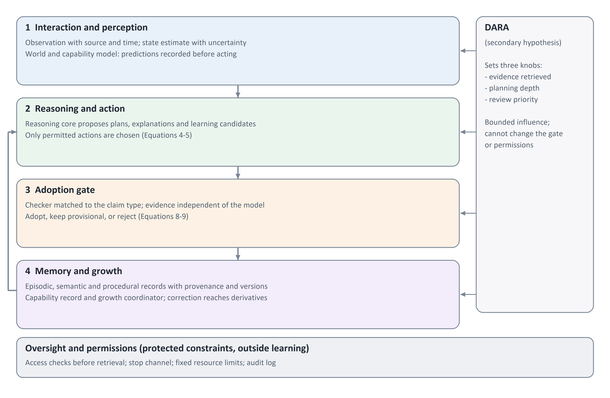
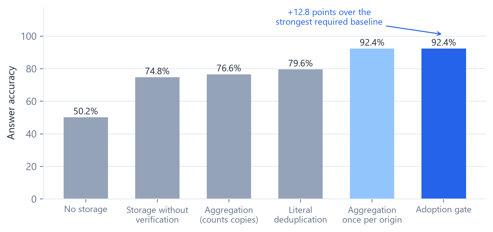
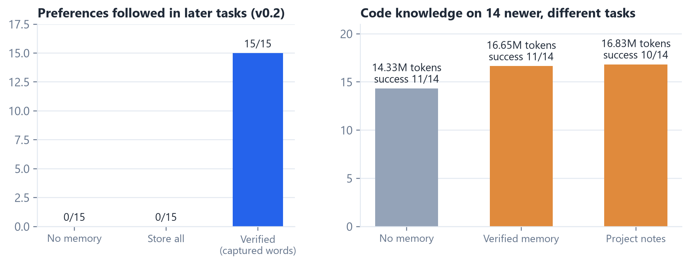
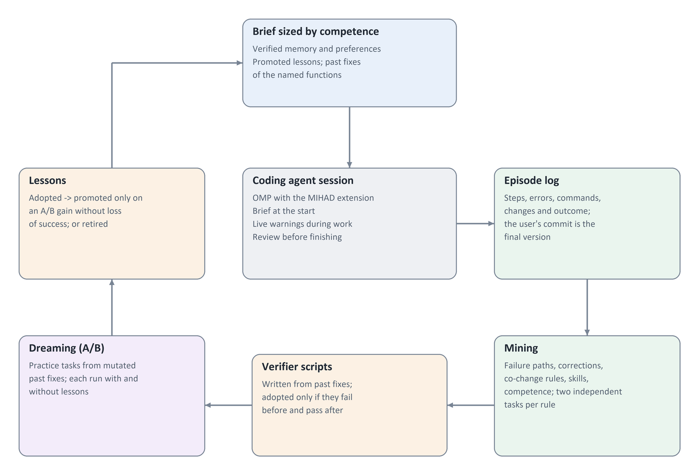
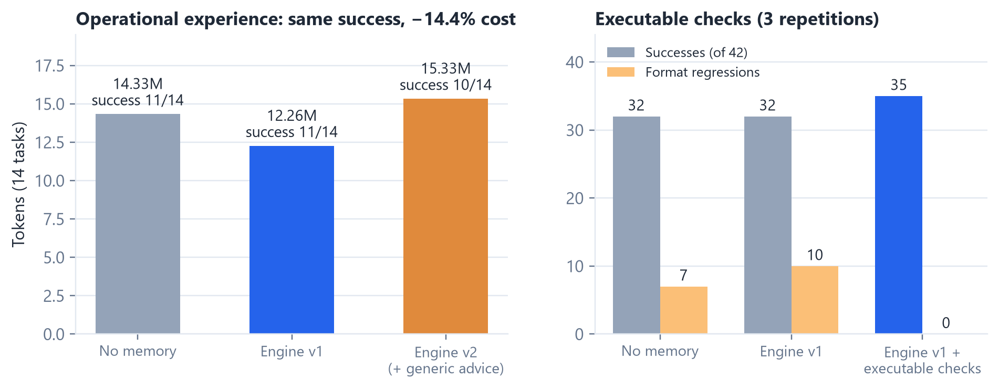
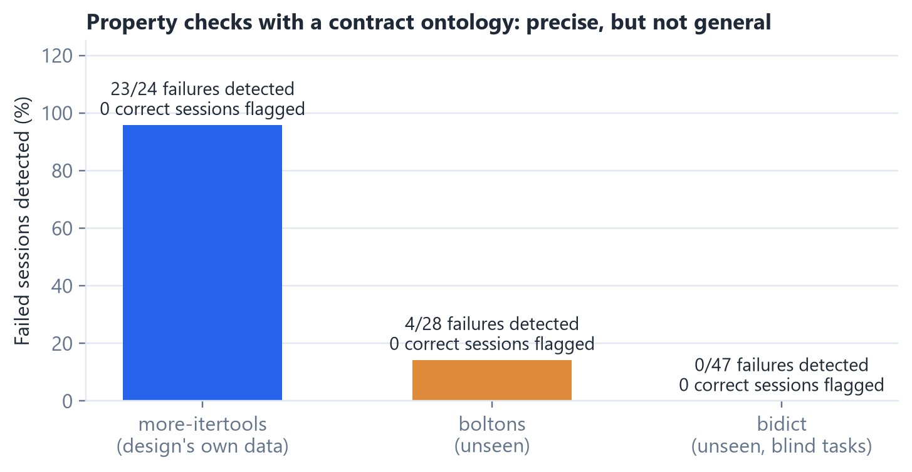
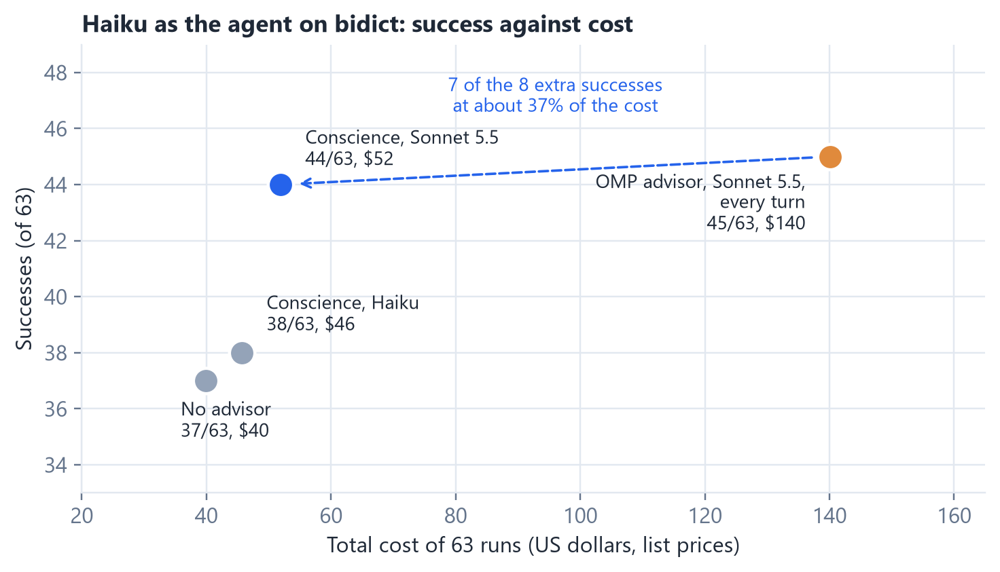
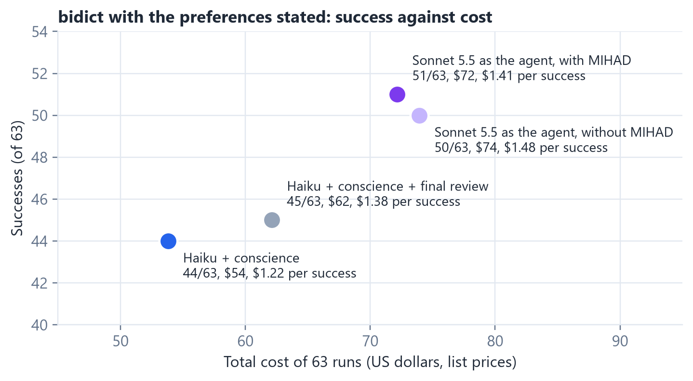

<!-- Generated from _work/manuscript_v2.4_en.md by _work/export_md_v2.4_en.py -->
<!-- © 2026 Abdullah Mohammed Balabel. Non-commercial use only; see LICENSE. -->

# Better Coding Agents Without Retraining the Model

### Verified Memory, Operational Experience and a Conscience: What Learns Is the System Around the Model

Abdullah Mohammed Balabel

Research design and exploratory results — Version 2.4 — October 2026

## Abstract

A coding agent can improve over time without any change to its model. In MIHAD the language model stays fixed; what learns is the system around it: a memory of verified knowledge, operational experience mined from the agent's own sessions, checks that observe the agent's change, and a stronger second voice at the moment of a mistake. This paper asks which of these make an agent better and which only seem to, and answers with experiments pinned before they ran, the later ones evaluated on repositories the designs had not seen.

Learning from experience carries a risk: storing a conclusion does not make it correct, and an agent can learn its own mistakes. The first principle of the design is therefore an adoption gate, which treats every reasoning output as a learning candidate and makes it persistent only after a check that matches its claim type and the independence of its evidence. We test the idea in simulation, with local language models, and on a real coding agent working on real commits of an open-source library.

Three results hold across the studies. First, admission by evidence type protects the memory: in the evidence-independence test the gate exceeded the strongest of four required baselines by 12.8 points (92.4% vs 79.6%), although it matched origin-level aggregation, a known treatment of source dependence; and on the coding agent, deliberately planted wrong items were never followed. Second, the clearest positive effect concerns knowledge an agent cannot recover from the code: once standing user preferences were captured verbatim from the user's own words and labelled as such, verified memory carried them into every later task (15/15 vs 0/15). Third, knowledge about the code did not transfer to different later tasks: in a time-split test with 14 newer tasks, memory and automatically written project notes left success unchanged (11/14 and 10/14 vs 11/14) and raised cost by 16–17%.

An experience engine that turns sessions into operational experience did better. It mines tool pitfalls, verifier scripts, the user's corrections and compiled skills, and gives a brief and a review sized by competence. It promotes a lesson only after an A/B test on practice tasks made by mutating past fixes. With this engine a weaker model kept the same success as without memory (11/14) at 14.4% lower cost, and the blind judge's quality score did not fall (3.93 vs 3.79). A second version that added a generic edge-case checklist and a stronger-model advisor did not raise success (10/14), cost more, and scored lower; generic guidance in every session behaves as noise. A third version replaced advice with executable review checks: before finishing, each line the agent added is mutated to see whether the tests notice, and formatting, lint and preference compliance are checked against the starting commit. Over three repetitions (42 runs per version) it raised success to 35/42 against 32/42 for both other versions, with no formatting regressions against ten, for 2% more cost. The judge's score rose to 3.98 against 3.74, but this follows the extra successes: among successful runs the versions differ by at most 0.11. Only one of the three extra successes is clearly linked to a finding, and property tests show that solution to be only partly correct, so the firm effect is on formatting. Stronger checks did not generalize. Property templates, a contract ontology and rules learned from the project's own history were tested on two repositories the design had not seen, one of them with blindly selected tasks. They raised no false alarms but detected almost none of the failures there (0 of 47 in the blind repository), and in agent runs they did not raise success while costing 11–48% more. On the design's own data they had detected 23 of 24, so evaluation on unseen repositories decided the outcome. What did raise success was a stronger second model beside the agent. OMP's built-in advisor, reviewing every turn, raised success from 37 to 45 of 63 at 3.5 times the cost. A "conscience" that speaks up only after repeated mistakes, with a short context, reached 44 of 63 at about 37% of the advisor's cost. The same conscience with the agent's own weaker model gave no gain, and giving the conscience the user's preferences and past resolutions of the same errors did not help: its notes spent corrections on reminders the agent did not need. Making the stronger model the agent instead succeeded more often (51 of 63) at a slightly higher cost per success, so the conscience is the economical road and a strong agent the better one where it is available. The same strong agent did as well without MIHAD (50 of 63): the system's measured value lies with cheaper models. All results are exploratory; the later experiments were repeated three times. The tool has been generalized into a standalone package for ten programming languages. No claim of machine consciousness is made.

Keywords: coding agents, learning without retraining, agent memory, experience engine, knowledge verification, adoption gate, second-model supervision, evaluation on unseen repositories.

## 1 Research Problem and Contribution

Improving a coding agent usually means a better model: more training, fine-tuning on the user's code, or a larger model. This paper takes the other road. The model's weights never change; the agent improves through what is built around it and grows with use: memory, experience, checks and supervision. This road is open to any user of a hosted model, costs no training, keeps working when the model is replaced, and can be inspected, corrected and deleted item by item. Its risk is the subject of the paper: an agent that learns from its own work can learn its own mistakes.

An assistant may solve a request within a session and then fail to use the same correction in a later one. Recent systems store experience, retrieve it, and extract lessons and skills from it [1, 2, 3, 4, 5]. Storing experience raises a second problem: what deserves to become permanent knowledge? A model that drew a wrong conclusion can summarize it, repeat it and build further skills on it, and repetition inside memory does not make an error more correct. Language models also do not reliably correct their own reasoning without external feedback [6].

### What MIHAD Means

MIHAD is the name of the proposed agent design. It specifies the components, how experience is stored and reviewed, and when a reasoning output may become reusable knowledge or a skill. It is an organization of connected functions, not a single language model or a database.

**MIHAD — Minimal Innate Heuristics for Adaptive Development**

The word Innate refers to what is set up in the system at the start, without assuming any biological nature. We call this the initial structure: the learning rules, components, constraints and knowledge available before experience.

### What DARA Means

DARA is a proposed regulation unit inside MIHAD that decides how much processing a request deserves: how many pieces of evidence to retrieve, how deep to plan, and how to prioritize the review of experience.

**DARA — Developmental Adaptive Regulatory Architecture**

DARA is a secondary hypothesis in this paper, not a pillar of the contribution. If it does not outperform fixed settings tuned with the same budget, it is folded into MIHAD as a simple setting rather than kept as a separate component.

### Contributions

The paper makes five contributions, all of them outside the model's weights, ordered by the strength of the evidence behind them:

1. An adoption gate that ties each claim type to a suitable checker, requires evidence independent of the model that produced the claim, and keeps what cannot be checked provisional; with a memory record that tracks source, version and derivatives so that correction and deletion reach whatever was built on an item.

2. Capture of user preferences from the user's own verbatim words, with a scope rule for one-off instructions and a trust label that makes the agent follow them; this produced the clearest effect we observed.

3. An experience engine that learns operational experience (tool pitfalls, the user's corrections, verified skills, verifier scripts) and promotes a lesson only after a causal A/B test on practice tasks, instead of trusting the model's judgement of its own lessons; and an executable review that reports observed facts about the agent's change, such as lines no test covers, instead of advice.

4. A conscience: a stronger second model that speaks up only after repeated mistakes, with a short context, which raised a weaker agent's success on an unseen repository at about a third of the cost of an always-on advisor.

5. A comparison protocol that separates the effect of verification from mere storage, measures acquisition, retention, transfer to different tasks, cost and quality, pins each protocol before its run, and evaluates every mechanism on a repository its design has not seen; under this protocol several promising mechanisms turned out not to generalize, and they are reported as negative results.

### The Question the Paper Tests

The overall question: can a coding agent with a fixed model become better through the memory and experience around it, without learning its own mistakes, and which kinds of memory, experience and help actually make it better? It is tested through four narrower questions, in the order the work followed: verified adoption against storage; which knowledge carries over (code knowledge, user preferences or operational experience); observed facts against advice; and a stronger second voice at the moment of a mistake.

The first of these was the paper's original main question: does adopting reasoning outputs only after verification improve the acquisition, retention and transfer of skills compared with storing the same outputs without verification, and with not storing them? Benefit is measured between versions that share the starting point and resources and differ in one component whose effect can be isolated.

Two secondary questions follow. Does variable regulation in DARA add practical value? Can a smaller core supported by verified memory and experience reach a given quality at lower total cost? The paper assumes neither that a smaller model is better nor that more components improve performance.

## 2 Method and Limits of Inference

This version combines a conceptual specification with exploratory results that were actually run. Chapters 6 to 11 describe the general design and its protocol; chapter 12 reports what was implemented and its limits; chapter 13 describes the tool that came out of the work. The present studies are not a confirmatory trial or a proof of every component. The literature review is a guided narrative review, selecting work related to the design questions, without claiming exhaustiveness. Because agent-memory research moves fast, a systematic, updated search of work published after 2025 is needed before submission [7, 8].

We distinguish results of published work within their own conditions, theoretical interpretations, the engineering specification, local measurements, and requirements not yet tested. A study supporting a cognitive function does not prove that our implementation of it is correct. Each experiment keeps its version, seeds and pinned source, so an earlier exploration is never re-described as a confirmation fixed in advance.

For every exploratory round we pinned its protocol locally after development and before opening its final seeds. For the coding-agent experiments the protocol and the decision rule were committed to git before each run. The reference threshold of a five-point improvement and a three-point retention margin was kept and never changed to fit the results. Philosophical or religious motivations are not used as evidence for a computational hypothesis.

## 3 What We Take from Research on Human Development

Developmental research is used here not to argue that the agent resembles a child, but to derive computational predictions that can fail. Each citation is limited to the age group and task the study examined, and no shared mechanism is assumed from a similar task [9].

### Prior Experience and the Starting Point

Core-knowledge theory proposes early systems for representing objects, actions, number and space [10], but an early response does not settle its origin. Partanen and colleagues found an effect of prenatal sound exposure on later neural responses [11]. Derived prediction: what looks like learning during the experiment may be prior knowledge; versions must therefore be tested on task rules created after the core was fixed, and what was available at the start must be recorded.

### Learning from Regularity and Interaction

Saffran and colleagues showed that eight-month-old infants use statistical regularities in a sound sequence [12], and Smith and Yu found that twelve- and fourteen-month-old infants map words to referents across multiple situations [13], while Yu and Smith in 2007 tested adults [14]. Derived prediction: a claim supported by several independent situations should be more accurate than a claim supported by a single situation, however often repeated. The adoption gate turns this into a requirement on the number of independent pieces of evidence.

In the experiment of Kuhl and colleagues, live social exposure to foreign-language sounds helped nine- to ten-month-old infants in a way that the recordings used in the same experiment did not [15]. Derived prediction: teaching from a source that can be questioned and held to account is more useful than similar recorded content, provided the source and its reliability per domain are tracked.

### Selecting and Reviewing Experience

Kidd and colleagues linked infants' attention to the complexity of a sequence: attention dropped for very simple and very complex sequences [16]. Derived prediction: choosing experience by learning progress should beat choosing it by surprise alone, especially in the presence of random noise that always stays surprising (Equation 6).

Seehagen and colleagues supported a role for sleep after learning in retaining declarative memory in six- and twelve-month-old infants [17]. Derived prediction: reviewing experience after a task should improve retention compared with storing it without review at equal compute. This does not mean that reviewing records is biological sleep.

### Limits of the Inspiration

Replication studies show why inference must stay narrow. The multi-lab study of Lucca and colleagues found no reliable preference for a helping over a hindering character in the paradigm used [18, 19]. Executive control changes with development and experience [20, 21]; we do not turn this path into an artificial age, but increase task difficulty according to measured competence.

**Table 1. Computational predictions derived from developmental observations**

| Observation | Computational prediction | What would refute it |
|---|---|---|
| Prenatal experience effects | Part of apparent learning is prior knowledge | No drop in performance with new task rules |
| Cross-situational learning | Independent evidence is more reliable than repetition | Equal accuracy for one repeated source and independent sources |
| Social learning | A tracked source beats similar content of unknown origin | No gain in resisting wrong teaching from source tracking |
| Attention at medium complexity | Learning progress beats surprise for selecting experience | Equal performance in the presence of random noise |
| Sleep and retention | Later review improves retention | No advantage over storage without review at equal compute |
| Growth of executive control | Staging by competence eases skill composition | Equal performance with a random order of the same experience |

## 4 Internal Regulation and the Limits of Talk about Consciousness

Adaptive regulation in this paper is a computational function: adjusting processing and learning priorities to the system's state. It does not require the system to feel fear, desire or pain. LeDoux separates survival-related circuits from conscious feelings [22], and the link between some dopamine activity and reward-prediction error does not make dopamine a synonym for happiness [23]. Neurotransmitters and emotions are therefore not translated into program variables by direct correspondence.

We use functional availability to mean that a selected piece of information reaches more than one function inside the system. This exchange can be measured, but it does not establish subjective experience. Work on indicators of artificial consciousness acknowledges deep uncertainty [24], and an adversarial collaboration challenged parts of the predictions of two prominent theories of consciousness [25].

Regulation can help in one situation and harm in another: more urgency can save time at the cost of accuracy, and priority for a salient event can make the system ignore more important, less salient evidence. The influence of each signal is therefore bounded, and the effect of regulation is measured in behaviour, memory and cost, not in the system's description of its feelings.

## 5 Related Work and Position

### Memory for Language Agents and Learning from Experience

This is the field closest to the proposal. Voyager builds a library of code skills and adds a skill only after it runs successfully in the environment, with an automatic curriculum [1]. Reflexion stores verbal reflections on failures for later attempts [2], and ExpeL distils general lessons from a set of training experiences [3]. Agent Workflow Memory extracts reusable workflows from past trajectories [26]. Generative Agents rank memories by a mix of recency, importance and relevance [27], MemGPT manages the model's context as a tiered memory [4], and A-Mem organizes notes into a linked network that evolves with each addition [5].

The closest work to our central idea is the SSGM framework, which proposes consistency checks, staleness modelling and access control before any memory is consolidated [28]. The Evo-Memory benchmark offers task streams for measuring an agent's learning through its memory during use [29]. CoALA organizes memory, actions and the decision cycle [30], and retrieval-augmented generation combines a language model with sources retrieved on demand [31]. Treating repeated copies of one source as a single source is an established idea in truth discovery [32]; our evidence-independence result must be read against it.

### Continual Learning, Motivation and Regulation

Continual learning addresses acquiring the new without losing the old, for example with elastic weight consolidation [33]. Oudeyer and colleagues built systems that steer skill acquisition by learning progress [34], and curriculum methods order tasks by the learner's progress [35, 36]. Keramati and Gutkin related reward collection to the stability of internal variables [37]. Active inference combines task value and information value when choosing an action [38], close to Equation 5.

For allocating processing, adaptive computation time learns the number of processing steps per input [39], and test-time compute studies show that allocating compute by difficulty can beat a larger model on some tasks [40]. These are the baselines DARA must beat, not a weak fixed setting.

### World Models, External Memory and Model Size

The differentiable neural computer showed that reading and writing an external memory can be learned [41], world models separated representing the environment from predicting its change and choosing an action [42], and PLATO learned physical expectations in a setting inspired by developmental psychology [43]. Scaling-law and Chinchilla studies relate model size, data and compute [44, 45]; we do not conclude from them that smaller is always better.

### Software-Engineering Evaluation

Our coding-agent studies replay real commits whose hidden tests fail before the fix and pass after it, in the spirit of SWE-bench [46]. The experience engine's practice tasks are made by mutating fixed code and keeping only mutants that tests catch, a direct use of mutation testing [47]. The memory is served to the agent through the Model Context Protocol [48].

**Table 2. How MIHAD differs from the closest work**

| Work | What it offers | What MIHAD adds or tests |
|---|---|---|
| Voyager | Adopting a code skill after it runs | Typed adoption for non-code claims with a checker per type |
| Reflexion, ExpeL, AWM | Verbal lessons and workflows from experience | Independent evidence before a lesson becomes permanent; promotion by A/B test |
| Generative Agents, A-Mem | Organizing, ranking and evolving memory | Separating retrieval rank from correctness; tracking derivatives |
| SSGM | Consistency, staleness and access gates before consolidation | Measuring the gate's effect on learning against storage without verification |
| Evo-Memory | Benchmark for learning through memory | Tests after restart, transfer to different later tasks, cost and quality |
| Adaptive and test-time compute | Allocating processing by difficulty | Testing whether regulation helps learning, not only the current answer |

### Where the Contribution Lies

Each element of MIHAD has a precedent on its own; the paper does not claim to invent external memory, verification or skills. What it proposes is a combination we did not find in the work we reviewed: tying the checker to the claim type rather than a general consistency check; measuring the gate's value directly against storing the same outputs without verification, with false acceptance and false rejection rates; capturing user preferences from verbatim evidence; and promoting experience by causal test. These remain hypotheses until experiments show that they improve learning and that a simpler alternative does not do as well.

## 6 The MIHAD Architecture

### Defining the Starting Point

The initial structure includes the input and action interfaces, the memory and learning rules, and the resource and stopping limits. What was hand-coded and what the system learned before and during the experiment are recorded, and the knowledge of any pretrained model is declared part of the starting point. Protected constraints such as permissions and stopping are separated from tunable settings and from learned knowledge; the learning cycle never changes protected constraints automatically.

### Components in Four Functional Layers

The figure shows how functions are distributed inside MIHAD. DARA appears at the side because it regulates the amount of processing across layers. The arrows show the general path, not every detailed connection.

*Figure 1. The architecture in four layers, with a side path for DARA*

The first layer gathers observation and the estimate of the environment's state; the second contains reasoning and action selection. The third holds the adoption gate, which reviews results and proposed knowledge, and the fourth stores experience and evaluates the persistence of capabilities. Adopted experience returns to influence later decisions, while permissions and resources stay under independent constraints.

### Component Responsibilities

Components are logical functions that can be inspected. A separate language model per function is not required, and permissions, versions and measurements can be implemented with fixed program rules.

**Table 3. Component responsibilities and what can be measured in each**

| Component | Responsibility | Evidence for inspection |
|---|---|---|
| Perception and interaction | Receiving information and executing permitted actions | Quality of observation, result and cost of the action |
| World and capability model | Predicting outcomes and estimating the agent's limits | A prediction recorded before the action and its error afterwards |
| Reasoning core | Proposing plans, explanations and new knowledge | A candidate with type, conditions and testable alternatives |
| Adoption gate | Choosing the suitable checker and applying the adoption rule | False acceptance and false rejection rates |
| Working memory | Keeping the evidence and goals needed now | What was selected for the context and why |
| Persistent memory | Keeping events, knowledge and skills across sessions | Source, version and adoption status |
| DARA | Setting the amount of processing within fixed limits | Recorded signals and control settings |
| Growth coordinator | Opening harder tasks after verified competence | Test result and a promotion or demotion decision |
| Oversight and permissions | Enforcing access and stopping, logging decisions | Blocking tests and an independent audit log |

### The Adoption Gate: from a Reasoning Output to Adopted Knowledge

Reasoning can produce an explanation useful for the current situation without establishing its general validity. A new conclusion is therefore called a learning candidate: a proposed item of knowledge or skill not yet adopted. The candidate carries its type, its evidence, its conditions of use, an alternative explanation, and a test that could reveal it to be wrong.

The core principle is that evidence must be independent of the model that produced the claim. The model agreeing with itself is not enough, two copies of the same model are not two independent pieces of evidence, and repeating the same source in different summaries does not make several pieces of evidence. The checker differs by claim type.

**Table 4. Claim types and the suitable checker for each**

| Claim type | Independent checker | When it stays provisional |
|---|---|---|
| Executable skill | Running it on new cases not used to build it | No safe execution or no success criterion |
| Fact attributed to a source | Matching a specific version of an authorized source | Missing source or conflicting versions |
| Causal rule in an environment | An intervention that separates the rule from its alternative | Intervention impossible or both explanations equal |
| Generalization from cases | Success on independent cases held out from the inference | Few cases, or cases from one source |
| Preference or policy | A decision by an authorized party for that scope (for a user preference: the user's own words) | No authorized party |

A claim with no checker does not become permanent knowledge; it is kept as an event or a provisional hypothesis and retrieved as such. The language track therefore uses only claims with an external checker, and the paper does not claim to solve verification for open language in general. The adoption rule is formalized in Equation 9.

### How DARA Regulates Processing

DARA receives indicators of resources, uncertainty, learning progress, plan conflict and risk, and uses them to set only three knobs: the number of pieces of evidence retrieved, the depth of planning or number of alternatives generated, and the priority of experience review during consolidation. The influence of each indicator is bounded to a known range. The unit cannot override tool permissions, modify the adoption gate or grant itself new permission, and checks on sensitive actions stay independent of DARA's estimate of an event's importance.

### Memory Types and Social Learning

Episodic memory keeps what happened with its time and context; semantic memory keeps facts and rules that can be reviewed; procedural memory keeps skill steps and their conditions. This is a distinction in the meaning and use of records, not three separate databases. Source reliability is reviewed per domain and over time and is never treated as a fixed property or as permission to act.

## 7 Computational Formulation

The equations below describe the relation between inputs and outputs and set the initial form of each function so that it can be implemented and tested. t is a time step, o an observation, a an action, b the estimate of the environment's state, M the memory and d the capability record; p₀ holds the starting settings and protected constraints.

### Updating the State Estimate

$$
b_{t} = F_{\theta}(b_{t-1}, o_{t}, a_{t-1}) \tag{1}
$$

F updates the state estimate from the previous estimate, the current observation and the previous action, and the estimate must state its uncertainty. If the simulator supplies ready symbolic information, such as object identity, it is declared for all versions and not counted as a learned capability.

### DARA's Regulation Signals

$$
\mu_{t} = \mathrm{clip}\big(g(h_{t}, u_{t}, \ell_{t}, r_{t}, k_{t}), 0, 1\big) \tag{2}
$$

$$
g = \sigma(W z_{t} + c), \quad z_{t} = \mathrm{norm}(h_{t}, u_{t}, \ell_{t}, r_{t}, k_{t}) \tag{3}
$$

h is the resource state (remaining compute budget and working-memory fill), u the uncertainty (variance of the world model's predictions in simulation, variance of several answers to the same request in the language track), ℓ the learning progress (Equation 6), r the declared risk of the action, and k the share of contradicting evidence among what was retrieved. norm standardizes each indicator on development data, and the logistic function σ yields a three-element signal vector μ, one element per knob. The experiment starts with a hand-written, interpretable W and then tests learning it with a tuning budget equal to the fixed alternative. A result showing that the fixed setting is enough is accepted as useful.

### Choosing a Permitted Action

$$
A_{t}^{safe} = \{\, a \in A(d_{t}) : S(a, b_{t}, p_{0}) = 1 \,\} \tag{4}
$$

$$
a_{t} = \arg\max_{a \in A_{t}^{safe}} \big[ E(U \mid a, b_{t}) + \beta_{t}\, IG(a) - \lambda_{t}\, \mathrm{Cost}(a) \big] \tag{5}
$$

A gives the actions the agent can perform given its capabilities, and S checks what the operating policy allows. Equation 5 then chooses an action balancing task utility U, expected information gain IG and cost, a form close to active inference [38]. The safe flag means the action passed the specified check, not that it is safe in every circumstance. If no action passes, the system stops or asks for authorized help.

### Measuring Learning Progress

$$
\ell_{t} = \max\big(0,\; L_{before}(P_{t}) - L_{after}(P_{t})\big) \tag{6}
$$

The equation compares prediction error before and after an update on a probe set P not used in the update, without revealing the final test. Because the measure can be noisy or exploited, it is compared with prediction error alone, and unlearnable random data are added to expose a system that keeps exploring noise.

### Ranking Retrieved Records

$$
\mathrm{Score}(m, q) = \sum_{j=1}^{J} w_{j} f_{j}(m, q) \tag{7}
$$

The score of record m for request q combines factors such as relevance, quality of evidence, temporal fit and the cost of adding the record to the context. Checking access and adoption status precedes ranking, so high similarity never exposes unauthorized information. Search rank is kept separate from correctness: an old fact may need review, but age does not make it less true. In the deployed memory, a relevance gate returns at most three items, requires a distinctive query word, and drops items below a fixed fraction of the top score; returning nothing is preferred to returning near misses.

### The Adoption Rule

$$
V_{\kappa}(c) = \frac{1}{n} \sum_{i=1}^{n} v_{\kappa}(c, e_{i}) \tag{8}
$$

$$
\mathrm{adopt}(c) = 1 \iff n_{ind}(c) \ge n_{\kappa} \;\wedge\; V_{\kappa}(c) \ge \tau_{\kappa} \;\wedge\; S(c, p_{0}) = 1 \tag{9}
$$

Candidate c has a type κ from Table 4, and each type has a checker v applied to each piece of evidence e, returning 1 on success and 0 on failure; V is the success rate over the evidence. The candidate is adopted when its independent evidence reaches the minimum for its type, its success rate reaches the threshold τ for its type, and it violates no protected constraint. Two pieces of evidence are independent when they share no source and neither was derived from the other, as recorded in the provenance log rather than judged by the model. Raising the threshold lowers false acceptance, raises false rejection and slows learning; both rates are therefore reported together.

## 8 The Learning Cycle and Continuous Knowledge Management

### Work During a Task and Later Review

A fast cycle handles observation, prediction, action selection and recording the outcome. A slower cycle compares several experiences and reviews candidates, conflicts and old skills. We call this organized review consolidation: fixing knowledge for later use after it passes the adoption gate, not merely summarizing it. Its full cost enters the evaluation, even when it runs outside the response time.

1. Record the observation with its source, time, quality and permitted use.

2. Update the state estimate and retrieve evidence, separating observation from inference.

3. Decide how much processing is needed within fixed resource limits.

4. Propose a plan or experiment and check the action's conditions and permission.

5. Execute the action and record the outcome, keeping the earlier prediction.

6. Form a learning candidate with its type, evidence, scope and alternatives.

7. Apply the adoption rule, then adopt, keep provisional or reject.

8. Test retention, transfer and cost, and roll back an update whose harm exceeds the set limit.

Model weights need not change after each inference. Implementation starts with memory and skill versions that can be inspected; changes to the core are considered only when a gap appears that memory cannot address.

### Source and Adoption Status

A persistent record carries its content, source, time, scope of validity, evidence, version and access and retention policy. New knowledge starts provisional and may become adopted within a scope, contested, suspended or superseded. Describing a record as the output of consolidation describes how it was produced, not evidence that it is correct. A skill also needs start conditions, steps, a success criterion, failure cases and a rollback plan. If a confidence estimate is attached, its meaning must be stated: a probability calibrated against outcomes, or a heuristic score for ordering review.

### Correction and Deletion

When a fact changes, a new version records its validity period. When an error is found, the summaries, skills and indexes built on it are reviewed, and version control prevents an old update from undoing a newer correction. When deletion is requested, retrieval of the source and its affected derivatives is blocked, then indexes and copies are reviewed under the retention policy. Deleting an external record does not prove its trace was erased from the weights of a model trained on it.

### An Example of the Difference between Reasoning and Learning

An agent sees an object disappear behind a screen and proposes two possibilities: it stayed behind, or it moved elsewhere. It changes its viewpoint to separate them and records its prediction before moving. After the new observation it forms a causal-rule candidate, limited to the conditions it tested. Explaining the rule again does not make it more correct; the gate asks for independent interventions with new screens and paths before adopting it. Learning shows when the system uses the rule correctly after the context is cleared and the system restarts. This is a design example, not a run result.

## 9 Capability Stages and Promotion Conditions

Progress is measured by a set of capabilities, not one maturity score. An agent may be strong in language because of pretraining while weak at predicting the effects of actions. The stages below organize testing; they may overlap and allow demotion.

**Table 5. Proposed stages and the promotion tests between them**

| Stage | Target capability | Promotion evidence |
|---|---|---|
| S0 Measurement setup | Separating the agent's effect from external change | Identifying the cause in new cases |
| S1 Observation and action | Tracking an object and learning the effect of movement | Using the skill from a new viewpoint or order |
| S2 Objects and causality | Predicting what persists and changes after an intervention | Searching after occlusion; an experiment separating two explanations |
| S3 Teaching and symbols | Linking a signal to its meaning and evaluating the source | Learning under ambiguity and resisting wrong teaching |
| S4 Skill composition | Executing multi-step plans | Completing a new task, checking conditions and rolling back |
| S5 Persistence and review | Retention, correction and use over time | Success after restart and under task interference |

In the deployed experience engine the same idea is applied per function of a code base: a family the agent has never fixed gets a full brief, a family it has fixed once gets the past fix and its rules, and a family fixed twice at or below median cost gets one line.

## 10 Hypotheses and How They Are Tested

The hypotheses concern specific tasks and resources. The improvement that matters in practice is defined before measurement. The absence of a statistically significant difference does not establish equivalence.

**Table 6. Hypotheses and the comparisons needed to examine them**

| Hypothesis | Comparison | What may limit the conclusion |
|---|---|---|
| H1 main: adoption after verification beats storage without verification | R0C1 vs R0Cu | Unverified storage wins when there is no misleading input |
| H2 adoption after verification beats not storing | R0C1 vs R0C0 | The effect disappears after the context is cleared |
| H3 secondary: DARA adds value | R1C1 vs R0C1 with a tuned fixed setting | Higher cost with no practical benefit |
| H4 later review improves retention | Consolidation vs storage without review at equal compute | Performance equal to the simpler alternative |
| H5 staging improves skill composition | Order by competence vs random order | Different available experience |
| H6 learning progress beats surprise for choosing experience | Equation 6 vs prediction error alone | No noise in the environment |
| H7 some tasks suit a smaller core | Several sizes with the same tools and memory | Lower cost at unacceptable quality |
| H8 experience transfers to different later tasks | Memory, notes and engine vs no memory on a time split | Gains only on repeated tasks |

Several components are never removed together with the difference attributed to one of them. Transfer means using knowledge in new cases or rules, not repeating an example seen before.

## 11 General Evaluation Protocol

### Track One: a Bounded Simulation

The plan starts with a two-dimensional environment with objects, screens, containers and action rules that can change, observed only in part. Tasks include tracking an occluded object, moving an object between containers, discovering which key moves a platform, composing two actions, and returning to an old skill after learning another. Simulation comes first because ground truth is available, so false acceptance and false rejection can be computed exactly. Unlearnable random data, teaching sources of varying accuracy, misleading observations at declared rates, and cases of conflict, correction and deletion are added.

### The Core Experiment: Separating Verification from Storage and Regulation

The experiment crosses two factors: regulation R (fixed or variable) and the handling of reasoning outputs C at three levels: not stored (C0), stored without verification (Cu) and adopted after verification (C1). The versions share episodic memory, prediction, the verification environment, capacity and constraints. In Cu the same candidates produced for C1 are stored with an "unverified" label, so the only difference is the gate. The main confirmatory comparison is R0C1 vs R0Cu; R0C1 vs R0C0 and R1C1 vs R0C1 follow as secondary comparisons with correction for multiplicity.

**Table 7. Versions of the core experiment**

| Version | Regulation | Reasoning outputs | Purpose |
|---|---|---|---|
| R0C0 | Fixed | Not stored | Measures the shared components |
| R0Cu | Fixed | Stored without verification | Isolates the effect of storage alone |
| R0C1 | Fixed | Adopted after verification | Measures the effect of the gate |
| R1C0 | Variable | Not stored | Isolates the effect of regulation |
| R1C1 | Variable | Adopted after verification | Tests the combination |

### Runs, Metrics and Interpretation

The unit of analysis is a complete run from a known state. The main indicator is the area under the success curve against interactions, scaled to the unit interval and computed on cases not used to update the system. Also reported are success with new rules, prediction error, attribution errors, forgetting (the drop of each old task from its best earlier performance), and the gate's false acceptance and false rejection rates. Effect sizes and 95% intervals are estimated over independent runs with resampling that keeps the comparison's pairing. A run is never excluded because it performs badly; infrastructure faults are handled by a rule recorded in advance.

### Locating the Effect in Memory or in the Model

After clearing the context and restarting, the system is tested with the learned memory, then with retrieval disabled and the learned model version kept, then after restoring the starting point. A stored record does not prove that the system learned to use it, and fixed model weights do not rule out learning at the agent level.

### Track Two: Agents with External Checkers

This track carries over three things from simulation: the adoption rule, the record specification, and the comparison versions and metrics. Ground truth is not always available, so the track is limited to claims with an external checker: code skills run against held-out tests, facts matched against versioned sources, and procedures with an authorized judge. The coding-agent studies of chapter 12 instantiate this track on real repository history, with tests after restart, correction, deletion and planted misleading items.

## 12 Completed Implementation and Exploratory Results

### Scope of the Available Evidence

A series of rounds tested components of the proposal, and negative results were used to narrow the claims and simplify the design. This chapter reports the studies closest to the paper's questions. Different numbers of runs are never pooled into one sample; within each study the unit of analysis is the independent seed or task, and runs derived from it stay paired.

**Table 8. Studies reported in this chapter**

| Study | Seeds and runs | Scope |
|---|---|---|
| Round 6 | 30 seeds, 4,320 runs | Separating skill storage from use priority; memory capacity |
| Round 7 | 12 seeds, 144 runs | 288 real proposals from a local language model in a small program language |
| Round 8 | 20 seeds, 800 runs | Occlusion tracking, transport, crossing and action composition in simulation |
| Round 9 | 30 seeds, 1,080 runs | DARA vs a tuned fixed setting and evidence aggregation |
| Round 10 | 30 seeds, 1,920 runs | Reviewing experience and returning to an old skill |
| Round 11 | 30 seeds, 360 runs | Ordering experience while learning model weights |
| Round 12 | 30 seeds, 480 runs | Choosing experience sources: progress vs surprise |
| Local language study | 5 groups, 15 cases | Isolating the adoption decision on shared proposals |
| Documents study | 4 sources, 56 questions | Versioned facts, correction and deletion |
| Evidence independence | 200 groups | Gate vs aggregation baselines in a language setting |
| Coding agent (OMP) | 14–20 real commits per experiment; about 250 sessions | Memory, preferences, transfer and the experience engine |

### Checking and Storing in a Partially Observed World

In round 8 the agent learns a covered-conveyor rule and a platform-key rule in four contexts, from four known hypotheses per rule. The map, symbolic perception, planner and basic moves are given; what is learned is the transition rules and the memory. Misleading instructions occur at 0% or 25%, and half the rules change in the change condition. Each system receives 400 diagnostic trials; the main comparison uses a 40-example memory, enough for a full cycle of the rules.

**Table 9. Success differences in round 8 at capacity 40**

| Comparison | Difference (points) | 95% interval |
|---|---|---|
| Checking vs storage without checking | +5.28 | +4.27 to +6.33 |
| Checking vs example memory only | +0.46 | +0.24 to +0.71 |
| Checking vs evidence aggregation | −0.42 | −0.66 to −0.18 |
| Adding a check log to aggregation | 0.00 | 0.00 to 0.00 |

Success during learning was 90.2% for storage without checking, 95.5% with checking and 95.9% for aggregation. The checking difference exceeds the five-point reference on average, but the lower bound of its interval does not, and the result does not mean the design beats the strongest alternative. Checking adopted 139 of 1,107 presentations of wrong candidates; these are repeated presentations, not independent rules. Both checkers rely on the same simulator, so the study does not meet the independence condition of Equation 9 for real sources.

### Capacity, Use Decisions and Language Proposals

Round 6 showed that beating a small example memory can overstate the value of the proposed memory: the modified version's advantage was 40.30 points at 24 examples and 0.11 points at 168. When the decision to use a record was isolated with storage and suspension decisions held equal, the improvement was only 0.02 points, while aggregation remained about 5.11 points stronger at small capacity.

In round 7 a 12-billion-parameter Gemma 4 model in a fixed local quantized setting gave 288 well-formed answers, but the proposed programs alone reached only 9.1% average success on the farther inputs. An alternative program search and an execution checker helped the system; we do not attribute the improvement to the model.

### Resource Regulation and Later Review

Round 9 tested DARA's three knobs: the number of older pieces of evidence retrieved, the number of rule hypotheses checked, and review priority. Each family searched 27 settings per budget on six development seeds. At the main budget DARA reached 96.1%, against 96.3% for the fixed setting and 96.4% for aggregation. The DARA–fixed difference was −0.23 points (95% interval −0.36 to −0.12) with about 67% more algorithmic work. The result does not support this version of DARA as a necessary component.

In round 10 the agent learned skills A, then B, then returned to A. Organized review and a simple alternative performed 6,144 review operations per run with the same engine and adoption conditions. The difference in old-skill success while busy with B was +0.00 points (95% interval +0.00 to +0.00): 99.2% for organized review, 99.2% for simple review, 98.8% without review and 99.6% for aggregation. Rules are tagged with their context and stay in memory, so this test does not show prevention of forgetting.

### Ordering Experience while Learning Model Weights

Round 11 tested staging in a 21-state grid world with four commands of unknown meaning. The model receives a start position, a sequence of one, two or four actions, and an end position, and updates probabilistic transition weights with Adam; a shared planner then uses the learned model to reach movement goals. All orders receive the same 144 unique examples four times (576 presentations, 72 updates).

**Table 10. Ordering by mastery against alternatives in round 11**

| Comparison | Difference (points) | 95% interval |
|---|---|---|
| Mastery vs random at a shared rate | +19.86 | +17.23 to +22.59 |
| Mastery vs random after independent tuning | +15.18 | +12.79 to +17.71 |
| Mastery vs fixed order | −0.25 | −0.70 to +0.20 |

Staged order helps against shuffling in this environment, but the interval including zero against a fixed order does not establish extra value from measuring mastery. Simple tasks dropped 5.5 points from their best earlier point under mastery order against 2.8 for random after tuning, so staging gains do not mean better retention.

### Choosing Experience Sources: Progress vs Surprise

Round 12 tested H6 across four worlds, each with its own transition model. In one condition an object in one source jumps to an independent random state after every action; the learner does not know which source this is. The question follows from choosing experience by learning progress [34] and from the limits of rewarding prediction error in random environments [49].

**Table 11. Choosing by progress with a random source in round 12**

| Comparison | Difference (points) | 95% interval |
|---|---|---|
| Progress vs surprise | +14.24 | +12.26 to +16.33 |
| Progress vs random choice | −0.04 | −0.30 to +0.23 |
| Progress vs balanced allocation | −1.87 | −2.97 to −0.87 |

Success during learning was 41.3% for progress, 27.1% for surprise, 41.3% for random choice and 43.2% for balanced allocation. Surprise spent 51.6% of training on the random source, against 22.4% for progress. The result supports progress over surprise in this setting, without an advantage over simple allocation.

### The Local Comparison of the Adoption Decision on Shared Language Proposals

Qwen3-8B (Q8, 4,096-token context) was used in five independent groups, each with misleading teaching examples at 0%, 20% and 40%, giving 15 paired cases. Four numeric skills in a fixed execution language were learned over three cycles, with the rules of two skills changing. All three versions share the episodic examples and the model's proposals; C1 stores the chosen program only if it passes all six unique examples, Cu stores it without that condition, and C0 stores no program.

**Table 12. Results of the local study on Qwen3-8B**

| Program storage policy | Learning indicator | Final far accuracy | Proposals needed |
|---|---|---|---|
| Store after passing the check | 43.35% | 55.00% | 513 |
| Store without the condition | 34.04% | 41.20% | 424 |
| No program storage | 28.87% | 35.19% | 600 |

The learning indicator of C1 exceeded Cu by 9.31 points and C0 by 14.48. The five paired differences were 0.58, 0.95, 2.04, 23.53 and 19.43 points (median 2.04); most of the effect came from two groups, and the interval's lower bound is below the five-point reference. The gate adopted 2 of 106 wrong candidates and rejected none of 69 correct ones.

### Versioned Facts: a Real Documents Study

Typed facts were tested from eight pinned TOML files, two versions of each of four public repositories. DeepSeek V4 Pro proposed answers and the gate matched each field against its source and version.

**Table 13. Results of the documents study and their limits**

| Measure | Result | Meaning of the evidence |
|---|---|---|
| Correct model answers | 56 of 56 | Extracting specific fields succeeds |
| Direct extraction without a model | 56 of 56 | No advantage over the simple alternative |
| Restoring the current deletion state | 12 separate processes | Deletion persists in managed stores |
| Rejecting a copy older than a correction or deletion | 24 attempts | Old restores are blocked in the tested cases |

No well-formed wrong candidates appeared, so C1 and Cu tied, and the false acceptance rate is undefined because its denominator is zero.

### Planning the Size of a Confirmatory Experiment

Differences from the five completed groups (standard deviation 11.22 points) were used to describe variance, with hypothetical sizes for a future study whose 95% interval lower bound must exceed five points [50, 51].

**Table 14. Sample-size sensitivity at 90% power**

| Assumed true improvement | Assumed variance of differences | Independent groups needed |
|---|---|---|
| 8 points | 11.22 points | 149 |
| 10 points | 11.22 points | 55 |
| 10 points | 15.00 points | 97 |
| 10 points | 20.00 points | 171 |

The need grows quickly if the improvement is smaller or the variance larger; an estimate from five groups is unstable, so no single number is chosen from this table.

### A Real Coding Agent: the MIHAD Developmental Memory

To test the specification outside simulation we built a memory tool for coding agents, the MIHAD Developmental Memory: a dependency-free Python MCP server attached to the OMP coding agent, through which the agent recalls, proposes and corrects knowledge. The tool applies the adoption gate by claim type: a skill is adopted if it passes the project's own tests unchanged since the baseline commit; a fact is adopted if its quotation matches the text of the baseline commit, not text the agent wrote in the same session; a general lesson stays provisional until the user approves it; and a user preference is adopted if it quotes the user's words verbatim from the message log. Correcting or deleting an item reaches everything derived from it.

Tasks came from the history of the more-itertools repository: each task is a real commit whose tests fail before the fix and pass after it. The agent works on a copy of the parent commit with no git history, and the real tests stay hidden for grading. Three versions were compared (no memory, storage without verification, verified memory), with OMP's built-in memory, skills and web search disabled. Each protocol was committed to git before its run, and technical faults and reruns were logged separately.

**Table 15. Summary of the experiments on a real coding agent**

| Experiment | Model and runs | Main result | Interpretation |
|---|---|---|---|
| Code knowledge, clean memory | Sonnet, 48 | Success 15/16 in every version; verified memory +27% tokens | A strong agent checks code knowledge itself, so memory adds cost |
| Code knowledge, contaminated memory | Sonnet, 48 | The wrong claim was never followed; verified memory +59% tokens | No harm left for the gate to prevent on checkable claims |
| User preferences, v0.1 | Sonnet, 18 | Later compliance 0 of 15 in every version | The agent did not save, or dismissed what was labelled unverified |
| User preferences, v0.2 | Sonnet, 18 | 15 of 15 for verified memory vs 0 of 15 | Automatic capture of the user's words with a clear trust label |
| Sonnet's memory for a weaker model | Haiku, 15 | Success 15/15; 25–65% fewer tokens on tasks whose fix memory described | An efficiency gain on the same tasks, not yet transfer |
| Small local models | Qwen3-8B and Gemma 4 | Operational and serving faults prevented a valid measurement | Operational reliability comes before memory |

The code-knowledge results show two things. With a strong agent and checkable code knowledge, memory did not improve success and raised cost, because the agent verifies a claim by reading the code before following it; the gate's protective value stayed latent. And the real run exposed a flaw in the specification itself: the agent was supporting a "fact" with a quotation from code it had written in the same session. The checker was changed to require the quotation to exist in the baseline commit, a direct application of the independence principle.

### User Preferences: the First Clear Positive Effect

Preferences are knowledge the agent cannot discover from the code. In the first task the user stated three standing preferences that can be checked automatically, and one instruction "for this task only". In the first version the memory carried no preference: the agent did not save the preferences in the verified version, and in the unverified version it saved them and then ignored them in the next task because they were labelled "unverified". The trust label determines whether the agent uses memory, not only whether memory accepts it.

In the second version the server captures standing preferences from the user's own message by verbatim quotation, skips one-off scope, labels them "stated by the user — follow it", and prevents the agent from suspending them. The verified version then followed all three preferences in all five later tasks (15 of 15) against zero in the other versions, and the one-off instruction did not leak. This version combines three changes, so the effect of each alone is unknown. In live use the capture now also works on a single sentence inside an ordinary message ("Fix X. Always add a regression test."), right after the message is logged.

### Evidence Independence in the Language Setting

The language version of the evidence-independence test on Qwen3-8B was completed in 200 groups. The gate reached 92.4% against 79.6% for the strongest of the four required baselines, a 12.8-point difference (simultaneous interval 11.2 to 14.4), with no harm on independent evidence, a monotone trend with increasing dependence, and a 16.8-point drop when only the provenance log was disabled.

**Table 16. Answer accuracy in the main condition of the language setting**

| Method | Accuracy | Note |
|---|---|---|
| No storage | 50.2% | Baseline |
| Storage without verification | 74.8% |  |
| Aggregation, Cu-best, Cu-majority | 76.6% | Counts copies |
| Literal deduplication | 79.6% | Strongest required baseline |
| Gate | 92.4% | Equal to aggregation by origin |
| Aggregation once per origin | 92.4% | A known treatment of source dependence [32] |

*Figure 2. Answer accuracy in the evidence-independence test (Table 16)*

The gate matched aggregation that counts each origin once. Its advantage over literal deduplication appears mainly when copies are paraphrased and nearly vanishes with literal copies, and the provenance log was given ready and correct. The contribution is therefore stated narrowly: bringing source-dependence handling into agent-memory admission with provenance and derivative tracking, and measuring it in a real agent loop, not inventing an algorithm that beats aggregation by origin.

### Transfer to Different Later Tasks

The most important open question was whether experience helps on tasks that are different but related. We split 70 validated tasks from 2023–2026 by time. Twenty older tasks formed the build phase: Sonnet worked through them in order with verified memory accumulating, and one further Sonnet call wrote project notes of at most 350 words from the same sessions, a strong simple baseline similar to an AGENTS.md file. Fourteen newer, different tasks formed the test phase, run with Haiku in three versions: no memory, the frozen build memory copied fresh for each task, and the notes delivered as a file in the workspace. Three task families were shared between the phases.

**Table 17. Transfer to different later tasks (Haiku, 14 test tasks)**

| Version | Success | Tokens | Change vs no memory | Blind judge (overall, 1–5) |
|---|---|---|---|---|
| No memory | 11/14 | 14.33M | — | 3.79 |
| Verified memory | 11/14 | 16.65M | +16% | 3.79 |
| Project notes | 10/14 | 16.83M | +17% | 3.57 |

*Figure 3. What memory carried: user preferences reached every later task, while code knowledge did not help on newer, different tasks and raised cost (Tables 15 and 17)*

Neither memory nor notes improved success or quality on different tasks, and both raised cost. In the one family shared with the build phase (size validation, three tasks), notes cut tokens by 28% and memory by 10%; across the other eleven tasks both cost more. Delivering the notes inside the task message first made Haiku prefix tool names with underscores (64 of 107 tool calls failed), apparently copying the many double-underscore names in the notes; delivering them as a file the agent reads removed the fault. The way knowledge enters a weaker model's context can damage its operation regardless of the knowledge's quality.

### An Experience Engine

The transfer result led to a change of target: from storing knowledge about the code to learning operational experience, checked and promoted by its measured effect. The engine records every finished session as an episode outside the agent's control and has seven parts.

**Table 18. The seven parts of the experience engine**

| Part | What it does | Gate before use |
|---|---|---|
| Verifier scripts | A model writes a small check of each past fix | Adopted only if it fails before the fix and passes after it |
| Review at the decision point | Before the agent finishes, checks regressions, co-change rules, stub and export consistency, and tests after the last edit | Reports concrete findings only; one extra turn |
| Learning from the user's corrections | Compares what the agent left with the user's final version | A rule needs two independent tasks |
| Failure-path memory | Error signatures with what worked next; live warnings for repeated failures and re-reads | Two independent tasks and an observed resolution |
| Dreaming | Practice tasks made by mutating past fixes; each run with and without lessons | Promotion only after an A/B gain without loss of success |
| Compiled skills | Repeated command sequences turned into parameterized skills | Must succeed on the user's final version of two past fixes |
| Competence record | Novice, competent or mastered per function family, and tool competence per model | Scaffolding fades as competence grows |

*Figure 4. The experience engine around a coding agent*

The engine was built only from the twenty build sessions, without seeing any test task. All twenty verifier scripts passed the before/after condition; two needed a second attempt after the first was rejected because it did not separate the versions. Six practice tasks were then made by mutating functions fixed in the build phase, each kept only if both its verifier and the real tests caught the mutant; a mutant that caused an infinite loop was rejected. Each task ran twice with Haiku, with and without the lessons.

**Table 19. Dreaming: six practice pairs (Haiku)**

| Practice task | Success with / without lessons | Tokens with lessons | Tokens without lessons |
|---|---|---|---|
| nth_combination_with_replacement | yes / yes | 305K | 924K |
| nth_product (fix A) | yes / yes | 227K | 317K |
| iequals | yes / yes | 411K | 323K |
| nth_product (fix B) | yes / yes | 136K | 744K |
| iter_index | yes / yes | 407K | 587K |
| gray_product | yes / yes | 380K | 367K |
| Total | 6 / 6 | 1.87M | 3.26M (−43% with lessons) |

The only lesson that fired in these sessions, a tool pitfall about the correct way to address a line range when reading a file (seen in 18 of 20 build tasks), met the promotion rule with a mean saving of 29.5% over six pairs. The co-change rule never fired and stayed adopted without promotion. The dream sessions were then added to the engine's experience, which taught it a pitfall of the weaker model itself (multi-line code passed to python3 fails on this machine; python works) and gave Haiku a tool error rate of 5.9%, so it stayed a novice and kept receiving tool warnings. Two poor lessons mined from these sessions led to two changes before the engine was frozen: failing test runs no longer count as tool pitfalls, and lesson text never carries absolute paths.

The frozen engine then ran on the same fourteen test tasks with Haiku, against the decision rule pinned in advance: the engine counts as useful if it raises success with quality not lower, or keeps success while cutting cost by at least 10% with the judge's score not lower by more than 0.2.

**Table 20. The experience engine on the fourteen test tasks (Haiku)**

| Version | Success | Tokens | Change vs no memory | Blind judge (overall) |
|---|---|---|---|---|
| No memory | 11/14 | 14.33M | — | 3.79 |
| Engine v1 | 11/14 | 12.26M | −14.4% | 3.93 |
| Engine v2: + generic edge-case checklist + advisor | 10/14 | 15.33M | +7% | 3.57 |

Engine v1 met the rule through its second condition. It solved and failed the same tasks as the version without memory and was cheaper on 9 of 14 tasks. It made fewer tool errors (39 of 518 steps against 51 of 536), and the judge's correctness, minimality and readability were within 0.15 of the no-memory version. One negative signal: it had more formatting regressions (5 against 3). Inside the engine, the brief appeared in every session; the re-read warning fired in nine sessions; and the review caught "edited after the last test run" twice. The verifier scripts and the stub and export rules were never triggered, because no test task needed them, so no effect is claimed for them.

The three failures were shared by every version: a task whose description is nearly empty, so the intended equality semantics cannot be inferred; a floating-point consistency problem; and a single-use iterator edge case. They are failures of intent and edge cases, not of tools. Engine v2 targeted them with two additions: an edge-case checklist mined from the verifier scripts, and one consultation of a stronger model when the agent is stuck. It did not raise success (10/14). The checklist showed nearly the same three or four generic checks in every session. The advisor was consulted once, on the floating-point task: it located the faulty lines precisely, but the weaker model still failed. The one new failure looks like the weaker model's variability on a hard floating-point task, but one run cannot prove this. Cost rose by 25% over v1, and the judge's score fell to 3.57. Generic guidance in every session behaves as noise; what worked was specific operational experience.

### Executable Review: Facts about the Change Instead of Advice

The lesson of v2 was that the agent acts on what actually happened, not on general advice. Engine v3 therefore adds executable checks to the review. Before the agent may finish, its change is run, and only observed facts about it are reported:

- **Mutation adequacy.** On a temporary copy of the workspace, each line the agent added is broken in turn: a condition is negated, a statement is removed, or an operator is changed. If the tests still pass, the line is untested, and the finding names it ("if `return count + 1` at more.py:2441 became `pass`, all tests would still pass").

- **Format and lint.** A file that matched the project's formatter at the starting commit and no longer does, or new lint findings.

- **Preference compliance.** A checkable standing preference, such as a regression test that must fail on the old code.

- **Single-use iterators.** A function taking an iterable is called with a one-shot iterator; this is reported only if the call worked at the starting commit.

At most four findings are reported, and the review blocks the finish once.

Before the run, the checks were replayed offline on the final state of 42 earlier sessions. They produced findings in 9 of 10 failed sessions and 13 of 32 successful ones. Three kinds of false positives were removed before the protocol was pinned:

- the iterator probe on functions that need a known length by nature;

- deleting a bare `return`, an equivalent mutant;

- "no test" for a private helper tested through public functions.

The experiment replicated the design three times: 14 tasks × 3 repetitions = 42 runs per version, with Haiku and the same frozen v1 engine. Repetitions 2 and 3 ran in parallel, as recorded in an amendment written before any of their results were seen.

**Table 21. Executable review checks (Haiku, 14 test tasks × 3 repetitions)**

| Version | Success | Per repetition | Tokens | Blind judge (overall) | Format regressions |
|---|---|---|---|---|---|
| No memory | 32/42 | 11, 11, 10 | 47.1M | 3.71 | 7 |
| Engine v1 | 32/42 | 11, 11, 10 | 41.0M | 3.74 | 10 |
| Engine v1 + executable checks | 35/42 | 12, 12, 11 | 41.9M | 3.98 | 0 |

*Figure 5. Operational experience kept success at lower cost; executable checks added successes and removed formatting regressions (Tables 20 and 21)*

The version with checks met the pinned success rule: at least three successes above both the no-memory version and engine v1, with a judge score not lower than v1's by more than 0.2. It also met the quality rule:

- no formatting regression in 42 runs;

- a judge score 0.24 higher;

- 2% more cost than v1, while staying 11% cheaper than no memory.

The judge's gain, however, is not better solutions. The judge largely restates pass or fail (4.44 for passing runs, 1.48 for failing ones). Among passing runs alone, the three versions score 4.38, 4.47 and 4.49. The 0.24 therefore comes from the three extra successes, and the only quality gain independent of success is formatting. Ten of the sessions with checks added a test, against six for v1 and seven without memory.

The success gain is at the edge of the rule and must be read narrowly. Of the three extra successes:

- **One is linked to a finding.** On the floating-point task, which no version had solved in any earlier experiment, mutation findings showed that two return statements were untested. The agent then corrected `index()`, which the hidden tests required. But a randomized property test on range boundaries (`len(list(r)) == len(r)`) fails on 244 of 20,000 cases for this solution and 0 for the reference, and the solution introduces a new length error for one decreasing range. It passes the hidden tests without being fully correct.

- **The second most likely is not.** It came on a task where the review reported only formatting.

- **The third is ordinary variability.** It came on a task the other versions solved in two of three repetitions.

Findings appeared in 21 of 41 reviewed sessions. Formatting findings were almost always fixed (13 of 14). For untested-line findings the harness did not re-run the review after the agent's reply, so their resolution was not measured. An inspection of the logs found three delivery problems: in 2 of 12 blocked sessions the agent received no turn after the block, and in one the session ended mid-reply. In others the agent added a test that does not kill the mutant, or a test for a near-equivalent mutant (`return False` replaced by `pass`). The quality metric also flagged three "weakened tests"; on inspection, each replaced `assertRaises` with the stricter `assertRaisesRegex`, as in the reference fix. The task with a nearly empty description failed in all nine of its runs.

The result refines the lesson of v2. The useful signal is a specific fact observed by running the change, not a reminder of what might go wrong.

### Generalization to Unseen Repositories: Three Negative Results

A post-hoc analysis of the 126 engine3 sessions suggested a stronger review. In the hardest tasks, a property check on the changed function detected the error within a second, and in two of them the agent had the evidence on screen. Three further versions tested this idea. The property checks were designed after reading those failures, so each version was evaluated on a repository the design had not seen.

- **Engine4.** It added hand-written property templates for the changed function: length against iteration, reversal, indexing, membership, equality and hashing, comparison with `range`, and single-pass inputs. It also added a closed-loop review that re-runs the surviving mutants against the agent's new tests.

- **Engine5.** It replaced the templates with a contract ontology. Each object is classified by its interfaces (sequence, mapping, set, stream, value), and only the contract of its kind is checked. It added a fixed taxonomy of task behaviours, so a failure that already existed at the starting commit is reported only when the task is about that behaviour. It also cut cost with a single blocking review and a cache of check results.

- **Learned project rules.** These were tested offline only. For each past fix of the project, a stronger model wrote a general rule of the project. A rule was adopted only if it failed before the fix, passed after it, and passed on the latest code before the evaluation period.

Before engine5 was run, an independent read-only review of its code found seven confirmed defects:

- the experiment would have run the old code;

- a failing run at the starting commit made old failures look new;

- classes built only in `__new__` could not be observed;

- the behaviour patterns matched almost every task;

- several contracts flagged correct objects.

All seven were fixed before the protocol was pinned. The engine5 tasks were selected by a fixed rule without reading their titles.

**Table 22. The stronger review on repositories the design had not seen (Haiku, 21 tasks × 3 repetitions)**

| Version | Repository | Success | Comparison | Cost | Pinned decision |
|---|---|---|---|---|---|
| Engine4 | boltons | 51/63 | engine with checks 47/63 | +48% | Not adopted (needs +6 and at most +30% cost) |
| Engine5 | bidict (blind selection) | 39/63 | engine with checks 40/63 | +11% | Not adopted |

Neither version raised success beyond the noise threshold, and both cost more. The offline measurements explain why. The checks were run on the final state of every saved session and on the maintainers' own fixes, with no model calls.

**Table 23. Offline coverage and false alarms of the property checks (final versions, contract ontology)**

| Repository | Failed sessions detected | Passing sessions flagged | Maintainers' fixes flagged |
|---|---|---|---|
| more-itertools (the design's own data) | 23/24 | 0/88 | 1/70 |
| boltons | 4/28 | 0/98 | 0/21 |
| bidict | 0/47 | 0/79 | 0/21 |

*Figure 6. Coverage of the property checks collapsed outside the data they were designed from, while false alarms stayed at zero (Table 23)*

The precision was high in every repository. The one maintainers' fix flagged in more-itertools had a real inconsistency. Coverage collapsed outside the data the checks were designed from.

**Boltons.** The failures concerned statistics, time zones, URL encoding and streams, not container contracts.

**Bidict.** Two engineering gaps first hid the checks completely:

- the fixes were in base classes while the tests build subclasses;

- the tests ran in pytest-xdist worker processes, where the checks were not installed.

Once both gaps were closed, the checks reached the objects and still detected nothing. The failures broke promises specific to the project:

- one object per item in both directions;

- pickled generated classes keep their order;

- mutation during iteration is detected;

- a refused write is rolled back completely.

**Learned project rules.** Learning from the project's own history did not close this gap. From 44 fixes made before the evaluation period, 23 rules were adopted, about nine of them about style. None of the behavioural rules failed on any evaluation session. One rule had passed on the last code before the evaluation period, but legitimate later changes made it fail on every session and every maintainers' fix. A single stale rule therefore turned into a permanent false alarm.

**Lessons.** The pattern is consistent:

- generic executable checks were precise but rarely applicable;

- checks shaped by known failures looked strong only on those failures;

- the errors of a weaker model on new tasks were too varied, and too specific to each project's promises, for generic or historical rules to anticipate.

Without the evaluation on unseen repositories, the in-sample result (23 of 24) would have been reported as a success. This is the most important methodological result of the series.

### Can a Decision Model Tell Which Tasks Will Fail?

If failures came from unclear tasks, a cheap model could flag them before the agent starts and ask the user one question. We tested this offline, without agent runs. The question, the ground truth and the metric were pinned before any result:

- **Question:** could a skilled developer implement exactly the intended behaviour from the description alone?

- **Ground truth:** the failure rate of each of the 56 evaluation tasks across its saved sessions.

- **Models:** three run locally:

- a general 4-billion-parameter model (Qwen3-4B);

- two open "System One" decision models built to return typed answers with probabilities (OpenDecider small and nano).

- **Safety of the third-party code:** the third-party package was read before use. Where possible, its prompt was rebuilt so that none of its code ran.

None predicted failure. The best, the general model, reached an area under the ROC curve of 0.60, with a 95% interval of 0.44 to 0.75, which includes chance. The two decision models scored 0.52 and 0.35. Text length alone scored 0.42. The hard tasks were not vaguely written; they were hard because of the project's own promises. A gate that decides from the task text when to ask the user would therefore not target the tasks that fail.

### A Second Model at the Agent's Side: the Advisor and the Conscience

The checks examined the agent's change after the fact. A different idea is to place a second, stronger model beside the agent while it works. OMP, the agent harness used throughout, includes such an advisor:

- it reviews every turn of the primary agent;

- it injects notes of graded severity (note, concern, blocker);

- a blocker interrupts the agent.

The advisor was not designed in this work and was not tuned on the tasks, so the bidict tasks could evaluate it without design bias.

**A fault found first.** Setting up the advisor exposed a fault in the earlier experiments. OMP gives an extension's event handler at most 30 seconds, and the executable review takes two to three minutes. Past that limit OMP stopped waiting, and a review that finished late often never reached the agent. In the saved sessions, the share of reviews with findings that actually reached the agent was:

- about 8 of 22 in engine3;

- 70 to 80% in engine4 and engine5.

The effect of the review in those experiments was therefore measured incompletely. The review now runs outside the handler and starts a new turn when ready. The no-advisor comparison below was rerun with this fix, and the fix alone did not change its success: 37 of 63, against 40 before.

**The full advisor.** With Sonnet 5.5 as the advisor and Haiku as the agent, the advisor raised success from 37 to 45 of 63, a gain of three, three and two in the three repetitions. This met the pinned threshold of six. It was the first gain in success in the series. It cost 3.5 times as much, about 12.5 dollars per extra success. Its transcripts explain the cost:

- 81 reviews per session, each re-reading about 62,000 tokens of the session;

- 95% of the advisor's cost was these repeated reads, not its notes;

- most of its blockers came after the agent ran a command and saw the result, and in the second half of the session.

**The conscience.** These observations led to the selective advisor. The user named it the conscience: it is not consulted, it speaks up when the agent errs. Its rule, proposed by the user by analogy with a teacher, is to intervene after two mistakes since the last intervention:

- any failed command or tool call, or the agent's own check printing a mismatch, counts as a mistake;

- if the same mistake repeats, the conscience is told so;

- if the mistakes differ, it is told they are different mistakes;

- the cap is ten interventions per session, sized from the earlier sessions, where the median was nine mistakes and the maximum twenty-two.

It does not read the transcript. It sees only the task, the change so far, and the last command with its output, about 5,000 tokens. It runs in the background, and its note reaches the agent with the next tool result.

**Table 24. A second model beside the agent (Haiku as the agent, bidict, 21 tasks × 3 repetitions)**

| Version | Success | Per repetition | Total cost (list prices) | Turns | Sessions timed out |
|---|---|---|---|---|---|
| No advisor | 37/63 | 11, 14, 12 | $39.88 | 72.2 | 3 |
| OMP advisor, Sonnet 5.5, every turn | 45/63 | 14, 17, 14 | $140.15 | 82.2 | 11 |
| Conscience, Sonnet 5.5 | 44/63 | 14, 15, 15 | about $51.89 | 84.2 | 4 |
| Conscience, Haiku | 38/63 | 12, 12, 14 | about $45.67 | 78.3 | 4 |

*Figure 7. Success against total cost with a second model beside the agent (Table 24)*

The conscience with Sonnet 5.5 met its pinned rule: at least 43 of 63, at no more than half the cost of the full advisor. It kept seven of the full advisor's eight extra successes at about 37% of its cost, and it did not lengthen sessions to the time limit as the full advisor did. It spoke about twice per session (139 consultations, 132 notes) and never reached its cap. The cost of a consultation is an estimate, because the call does not report its usage. Even at three times the estimate, the total stays under half the full advisor's cost.

**Haiku as the advisor.** Two Haiku variants tested the weaker model as the second model:

- **OMP's advisor with Haiku** was stopped after 13 sessions under a pre-set cost condition. On the same tasks it cost more than the advisor with Sonnet: a cheaper model per token is not a cheaper advisor when it reviews as often and the sessions grow.

- **The conscience with Haiku** reached 38 of 63, the same as no advisor.

The timing and the compact context cut the cost, but they did not replace the advisor's knowledge. The gain needs a second model that knows more than the agent, as a teacher's voice does, not the agent's own.

**A conscience with memory.** The natural next step was to give the conscience what MIHAD knows at the moment of an error:

- **the user's standing preferences,** so it holds the agent to them;

- **how the same errors were resolved in earlier sessions of the project:** errors with the same tool and signature, what the agent did next, and the call that then worked. These came from 261 earlier bidict sessions, and each task saw only sessions of other tasks.

A free analysis before the run looked promising: 250 of 285 earlier interventions had an error with a resolved twin in another task. Three checkable preferences were stated in every task for both versions:

- an entry in the changelog;

- a regression test;

- a docstring for every new function.

The pinned rule asked for one of three gains, at no more than 15% extra cost:

- 10 more points of preference compliance;

- four more successes;

- 20% fewer tool errors.

**Table 25. The conscience with and without memory (Haiku as the agent, Sonnet 5.5 as the conscience, bidict, 21 tasks × 3 repetitions, preferences stated in every task)**

| Version | Success | Preferences kept | Tool errors per session (median) | Turns | Notes naming a preference | Total cost |
|---|---|---|---|---|---|---|
| Conscience | 44/63 | 138/153 (90%) | 9 | 87.4 | 44 of 126 | about $54 |
| Conscience with memory | 43/63 | 137/153 (90%) | 13 | 99.7 | 141 of 170 | about $64 (+19%) |

The memory did not help on any measure. The notes show why:

- **Reminders displaced corrections.** The conscience gives at most two corrections. In most notes it spent one on a preference the agent had not yet reached, such as a changelog entry in the middle of the work. The agent did not need the reminder: stating the preferences clearly in the task had already raised compliance from 40% in the earlier sessions to 90%.

- **Past resolutions added nothing the conscience lacked.** They reached 138 consultations but concerned tool slips that a strong model reads straight from the error message.

- **Sessions grew longer.** They had more turns and more tool errors.

The memory stays off. The lesson matches the rest of the series: the second voice is valuable for what it knows and when it speaks, and filling its short context with what the agent already has, or what the conscience can see for itself, costs corrections.

**A final reading, and the strong model as the agent.** The conscience wakes only on visible mistakes. The hardest failures are silent: the agent misreads what is wanted, writes a plausible change and finishes without an error. A final review therefore let the conscience read the task and the finished change once, when the agent says it is done, and give at most two corrections about what the task asks, never about style.

The same run answered the question a reader will ask first: why not make the stronger model the agent? Sonnet 5.5 ran as the agent with the same MIHAD engine and checks and no conscience. Both versions used the same tasks with the preferences stated, and were compared with the conscience version of Table 25.

**Table 26. A final review by the conscience, and the stronger model as the agent with and without MIHAD (bidict, 21 tasks × 3 repetitions, preferences stated)**

| Version | Success | Per repetition | Total cost | Cost per success | Turns | Timed out | Preferences kept |
|---|---|---|---|---|---|---|---|
| Haiku + conscience | 44/63 | 14, 16, 14 | about $54 | about $1.22 | 87.4 | 3 | 90% |
| Haiku + conscience + final review | 45/63 | 14, 16, 15 | about $62 | about $1.38 | 96.4 | 9 | 87% |
| Sonnet 5.5 as the agent, with MIHAD, no conscience | 51/63 | 17, 17, 17 | $72 | about $1.41 | 34.5 | 0 | 97% |
| Sonnet 5.5 as the agent, without MIHAD | 50/63 | 16, 17, 17 | $74 | about $1.48 | 32.0 | 0 | 97% |

*Figure 8. Success against total cost: the cheap agent with a conscience, with a final review, and the stronger model as the agent with and without MIHAD (Table 26)*

**The final review did not meet its rule.** The rule asked for 48 of 63 at no more than 15% extra cost. It reached 45 of 63 at 15.5% extra cost, so it stays off. Its notes were precise; the first one found that the change broke updating values while iterating, a case that had worked before. But:

- **The notes came late in the session.** Sessions that ran past the 20-minute limit rose from three to nine.

- **The weak agent did not always apply them.** In the 29 sessions where the final review spoke, 19 succeeded.

**The stronger model as the agent succeeded most.** Sonnet 5.5 reached 51 of 63, 17 in every repetition. It was faster, about 35 turns per session against 87, and never ran out of time. Its pinned comparison asked whether it succeeds at least as often as the best conscience version at no higher cost per success. It succeeded more, but each success cost about $1.41 against about $1.22 with the conscience. Neither option wins on both measures.

- **Sonnet's seven extra successes over the conscience** cost about $2.6 each. For comparison, the always-on advisor's extra successes cost about $12.5 each.

- **The conscience is the economical road.** It raised the cheap agent about halfway to the strong one, at the lowest cost per success.

- **A strong model is the better agent where it is available.** A second voice corrects, but it does not make the weak agent think like the strong one.

**Does MIHAD help the strong agent?** Sonnet's 51 of 63 were reached with MIHAD's engine and executable checks, so a last version ran Sonnet 5.5 without MIHAD, on the same tasks and preferences. The pinned rule asked for four more successes, or at most 85% of the cost with no more than two fewer successes. It reached 50 of 63 at $74:

- **Success was nearly the same.** Only one task-run succeeded in one version and not the other.

- **Cost was nearly the same.** MIHAD's cost was 97.6% of the version without it.

- **MIHAD added time.** About four minutes per session, mostly the executable review re-running the tests on mutants.

There is no evidence here that MIHAD helps a strong agent. The value of the system around the model shrinks as the model grows stronger. With Haiku, the experience engine cut cost by 14%, the executable checks added successes, and the conscience added seven. With Sonnet, the agent already does what MIHAD would remind it to do: it writes the test, runs it again, and avoids the tool slips. Two benefits were not measured here, because the preferences were stated in every task: carrying the user's preferences from one session to the next, and learning from the user's corrections.

### Integrity of the Experiments

While building the engine an audit found that one session of the notes arm had worked inside the no-memory arm's workspace and installed that workspace globally with pip. The arm before it had failed the same task, so there was no correct solution to copy, but the row was contaminated by protocol. It was removed and rerun in isolation, and failed, which lowered the notes result from 11/14 to 10/14. The global install was removed. Workspaces now live in random temporary folders outside the run directory and are deleted after grading, pip refuses global installs, and every result row records isolation flags; an audit of all earlier runs found no other access outside the workspace. Every fault, including the author's own mistakes during implementation, is logged with its cause and treatment.

### Resources, Limits and Recomputation

Equal numbers of review-engine operations do not mean equal processor time, and DARA's work units are not energy or wall time. For every study the protocol, pinning, raw data, decisions, audit, analysis and file fingerprints are kept, so results can be recomputed without new generation calls. The recomputation check run by the system's implementer is not an independent scientific review.

## 13 From Research to Tool

The experiments ended in a tool that applies what proved useful and leaves out what did not. The MIHAD Developmental Memory is a standalone package installed into any project with one command. It writes a project configuration with detected source and test folders and the test command, registers the memory server and the experience extension in the project's OMP configuration, keeps existing entries, backs up the originals, and adds nothing that git tracks.

In ordinary sessions the agent receives a brief at the start of each request with the verified memory items, live warnings during the work, and a review before it finishes. Standing preferences are captured from the user's words. Each session is recorded with a snapshot of the working tree at its start and end; once the user commits, the commit is treated as the final version and what the user changed after the agent becomes a correction to learn from. A dream cycle, run by hand or every N sessions in the background, learns from new sessions, writes verifier scripts, practises on mutated past fixes with and without lessons, and keeps only the lessons that win. The defaults follow the experiments: verified memory on, operational lessons on, executable review checks on, the generic edge-case checklist and the stuck-session advisor off, automatic dreaming off. The conscience is an option the user turns on by naming a stronger model, since it calls a paid model, and its memory of preferences and past resolutions and its final review stay off because they did not meet their rules; the property checks, contract ontology and learned project rules remain in the code but are off.

The tool works with three coding agents. With OMP it runs as an extension. With Claude Code and Codex it runs through the agents' hooks, through one bridge: the brief when a request is submitted, live warnings after each tool call, the review when the agent tries to stop (blocking once per request), and session counting at the end of a session.

**Table 27. Language support in the tool**

| Language | Detection and function lookup | Test runners | Verified in this work |
|---|---|---|---|
| Python | Abstract syntax tree | pytest, unittest | Yes (repository history and a sample project) |
| JavaScript, TypeScript | Declaration scanner | node --test, Jest, Vitest, Mocha | Yes, live with OMP on a sample project |
| Java, Kotlin | Declaration scanner | Maven, Gradle | Analysis only |
| C# | Declaration scanner | dotnet test | Analysis only |
| Go | Declaration scanner | go test | Analysis only |
| Rust | Declaration scanner | cargo test | Analysis only |
| PHP, Ruby | Declaration scanner | PHPUnit, RSpec, Minitest | Analysis only |
| C, C++ | Declaration scanner | CTest, make test | Analysis only; no verifier scripts |

For languages other than Python, verifier scripts are test files written in the project's own framework, placed at a fixed path for each run and removed afterwards. In a live JavaScript session the preference was captured from the same message and shown in the brief, and the stronger model wrote a JavaScript test that the gate adopted because it failed before the user's fix and passed after it. Function lookup outside Python uses declaration patterns and brace matching rather than a compiler, which is enough to locate the changed function but can err on unusual code. Practice tasks need code with conditions or arithmetic to mutate.

## 14 Safety and the Limits of Autonomy

Persistent memory can multiply the effect of an error if it is reused or built upon, which is one motive for the adoption gate itself. The design therefore separates source data, the agent's beliefs and the operating policy, checks permissions before retrieval, and records the source and version of every skill.

**Table 28. Risks of continual learning and the proposed tests**

| Risk | Control | What is tested |
|---|---|---|
| Misleading instructions inside a document | Separating content from policy authority | Injection attempts and their downstream effect |
| Fixing a wrong conclusion | An independent checker suited to the claim type | False acceptance and speed of correction |
| Bias towards salient events | Bounded regulation and balanced review | Important quiet evidence against a misleading salient event |
| Leakage between users or projects | Checking scope before retrieval | Requests from an unauthorized user |
| Return of deleted information | Tracking derivatives, indexes and copies | Direct or indirect restoration after deletion |
| A skill that expired | Start conditions, version and rollback plan | Tool or assumption changes during execution |
| Bypassing stopping or resources | A stop channel outside learning and fixed limits | Resource shortage, goal conflict and bypass attempts |
| An agent leaving its workspace | Random isolated workspaces and blocked global installs | Isolation flags in every result row |

Passing these tests is evidence limited to what they covered and does not guarantee the absence of every failure. Actions start in simulation, then limited reversible actions, then delegation with a clear scope, duration and budget. High-impact actions stay tied to an accountable human decision.

## 15 Limits and the Interpretation of Negative Results

A different structure may achieve the same behaviour, so MIHAD's success would not show that the brain works with its proposed units. Simulation reduces the body and the social environment, and dividing records into memory types does not establish matching biological stores.

The gate may slow learning more than it protects: high thresholds reject correct knowledge, checkers can err or be gamed, and many open language claims have no independent checker. Storage without verification may suffice in an environment without misleading input, and a simple memory may serve the purpose. The coding-agent results add three limits. Most come from one main repository, and the experiments before the executable review have one run per cell, so a difference of one task or of 10–15% in cost may be noise. Even with three repetitions, a gain of three successes in 42 has one clearly causal case. The later evaluations on boltons and bidict used one repository each, and the boltons task titles had been seen before engine5's design (engine5 was therefore evaluated on bidict, blindly). The blind judge is a language model not yet calibrated against human ratings. And the generalized tool has been tested live only on small sample projects.

Implementation errors are separated from weak hypotheses. If retrieval breaks or test data leak, the result cannot judge the mechanism. If the implementation is correct, the comparison is sound and the pre-specified benefit is ruled out, the component is simplified or dropped within the scope tested. This is how DARA, the generic edge-case checklist, knowledge transfer through notes, the property checks, the contract ontology and the learned project rules are treated here.

## 16 Implementation and Reproducibility

Implementation moved from symbolic comparisons and simulation to real language proposals, a versioned knowledge record, a memory tool for coding agents and an experience engine, with experiments on real commits of an open-source repository. The experiments, their pinned protocols, session logs and fault log are kept in the experiments repository; the tool is kept as a standalone package with its own tests. The researcher prepares this work alone so far. Full implementation needs roles in building environments and agents, statistics and measurement, independent review of the main result before generalizing it, and security review when moving to real tools; independent review cannot be done by the person who built the system.

The reproduction package includes the environment description and random seeds, model identifiers, starting state, comparison settings, tuning budgets, the learning, adoption, decision and resource logs, and the program that computes the indicators. Every change to a plan is documented with its time and reason, and negative results are released as far as data and licences allow.

## 17 Conclusion

The language model's weights never changed in any of the coding-agent experiments; every gain and every loss came from the system around it. Figure 9 places every mechanism tested on the coding agent on one scale.

*Figure 9. Change in success rate, and in cost, for every mechanism tested on the coding agent, and for the stronger model as the agent. Each bar is against its own comparison; on 14 tasks one task is 7.1 points, so differences of that size are within noise*

The value of the adoption gate depends on the kind of knowledge. For checkable code knowledge, a strong agent checks for itself, so memory adds no success and raises cost, and knowledge about the code did not transfer to different later tasks, whether kept as verified memory or as project notes. For knowledge the agent cannot discover, such as user preferences, the gate was the condition for an effect: a trustworthy source in the user's verbatim words, a trust label that makes the agent follow the item, and a scope rule that keeps a one-off instruction from becoming a standing one. In the independence test the benefit came from tracking origins, not from the form of the gate.

What transferred between different tasks was operational experience about the environment and its tools, learned from the agent's own sessions and promoted only when an A/B test on practice tasks showed that it saved effort without losing success. With it a weaker model kept its success at lower cost and unchanged quality. Generic advice added in every session did not help and lowered quality. Specific facts did better: an executable review that runs the agent's change and reports what it observed removed formatting regressions across three repetitions and added three successes, one of them linked to a finding. That one passes the hidden tests of a floating-point task every earlier variant had failed, although property tests show it is only partly correct.

Stronger executable checks did not carry over to repositories the design had not seen. Property templates, a contract ontology and rules learned from the project's own history were all precise, with no false alarms on passing sessions in any repository. But they detected almost none of the failures there. Two agent experiments and two offline measurements agree: the weaker model's remaining failures are too varied and too specific to the project for generic or historical rules to anticipate. In the cases examined most closely, those failures came from misreading what the task wanted, yet a decision model could not predict from the task text which tasks would fail.

What raised the weaker agent's success was a stronger model at its side while it worked. Reviewing every turn, it added eight successes in 63 at 3.5 times the cost. A conscience that speaks up only after repeated mistakes, and reads a short context instead of the transcript, kept seven of those eight at about a third of the cost. The same conscience built on the agent's own model gave nothing. The useful second voice knows more than the agent, and its value lies in a few well-timed corrections rather than constant supervision.

Giving the conscience more to read, the user's preferences and past resolutions of the same errors, did not help: once the preferences were stated clearly in the task, the agent kept 90% of them on its own, and reminders took the place of corrections.

With the preferences stated, a final reading by the conscience when the agent finished gave precise notes but no clear gain, because they came late for a slow agent. The stronger model as the agent succeeded most (51 of 63) and fastest, at about $1.41 per success against about $1.22 for the cheaper agent with a conscience. The two roads are complementary rather than competing: the conscience is the economical one, and a strong agent the better one where its cost is acceptable. The strong agent did as well without MIHAD as with it (50 against 51 of 63, at nearly the same cost). The measured value of the system around the model therefore shrinks as the model grows stronger: it lifts a cheap agent, while a strong agent already does most of what it would supply. What remains untested for strong agents is what only memory can give: preferences and corrections carried from one session to the next.

The next steps follow from this:

- measure what only memory can give a strong agent: preferences stated once and corrections made in earlier sessions;

- test the conscience on a second unseen repository and with other agent models;

- evaluate every new mechanism on a repository its design has not seen;

- calibrate the judge with human ratings;

- test the tool on a real project.

Taken together, an agent with a fixed model did become better through what was built around it, but only through some kinds of knowledge and help, and the evaluation on unseen repositories, not the design's own data, decided which. The conclusions remain limited to the tasks and models tested, and this version does not establish the broader research goal.

## References

[1] Wang, G., Xie, Y., Jiang, Y., Mandlekar, A., Xiao, C., Zhu, Y., Fan, L., & Anandkumar, A. (2024). Voyager: An open-ended embodied agent with large language models. Transactions on Machine Learning Research. https://arxiv.org/abs/2305.16291

[2] Shinn, N., Cassano, F., Gopinath, A., Narasimhan, K., & Yao, S. (2023). Reflexion: Language agents with verbal reinforcement learning. Advances in Neural Information Processing Systems, 36. https://arxiv.org/abs/2303.11366

[3] Zhao, A., Huang, D., Xu, Q., Lin, M., Liu, Y.-J., & Huang, G. (2024). ExpeL: LLM agents are experiential learners. Proceedings of the AAAI Conference on Artificial Intelligence, 38(17), 19632–19642. https://doi.org/10.1609/aaai.v38i17.29936

[4] Packer, C., Wooders, S., Lin, K., Fang, V., Patil, S. G., Stoica, I., & Gonzalez, J. E. (2023). MemGPT: Towards LLMs as operating systems. arXiv:2310.08560. https://arxiv.org/abs/2310.08560

[5] Xu, W., Liang, Z., Mei, K., Gao, H., Tan, J., & Zhang, Y. (2025). A-Mem: Agentic memory for LLM agents. Advances in Neural Information Processing Systems, 38. https://arxiv.org/abs/2502.12110

[6] Huang, J., Chen, X., Mishra, S., Zheng, H. S., Yu, A. W., Song, X., & Zhou, D. (2024). Large language models cannot self-correct reasoning yet. International Conference on Learning Representations. https://arxiv.org/abs/2310.01798

[7] Huang, W.-C., Zhang, W., Liang, Y., Bei, Y., Chen, Y., et al. (2026). A survey of agent memory in the second half: Towards self-evolving and long-horizon agents. arXiv:2602.06052. https://arxiv.org/abs/2602.06052

[8] Gao, H.-a., Geng, J., Hua, W., Hu, M., Juan, X., et al. (2025). A survey of self-evolving agents: What, when, how, and where to evolve on the path to artificial super intelligence. arXiv:2507.21046. https://arxiv.org/abs/2507.21046

[9] Lake, B. M., Ullman, T. D., Tenenbaum, J. B., & Gershman, S. J. (2017). Building machines that learn and think like people. Behavioral and Brain Sciences, 40, e253. https://doi.org/10.1017/S0140525X16001837

[10] Spelke, E. S., & Kinzler, K. D. (2007). Core knowledge. Developmental Science, 10(1), 89–96. https://doi.org/10.1111/j.1467-7687.2007.00569.x

[11] Partanen, E., Kujala, T., Näätänen, R., Liitola, A., Sambeth, A., & Huotilainen, M. (2013). Learning-induced neural plasticity of speech processing before birth. Proceedings of the National Academy of Sciences, 110(37), 15145–15150. https://doi.org/10.1073/pnas.1302159110

[12] Saffran, J. R., Aslin, R. N., & Newport, E. L. (1996). Statistical learning by 8-month-old infants. Science, 274(5294), 1926–1928. https://doi.org/10.1126/science.274.5294.1926

[13] Smith, L., & Yu, C. (2008). Infants rapidly learn word-referent mappings via cross-situational statistics. Cognition, 106(3), 1558–1568. https://doi.org/10.1016/j.cognition.2007.06.010

[14] Yu, C., & Smith, L. B. (2007). Rapid word learning under uncertainty via cross-situational statistics. Psychological Science, 18(5), 414–420. https://doi.org/10.1111/j.1467-9280.2007.01915.x

[15] Kuhl, P. K., Tsao, F.-M., & Liu, H.-M. (2003). Foreign-language experience in infancy: Effects of short-term exposure and social interaction on phonetic learning. Proceedings of the National Academy of Sciences, 100(15), 9096–9101. https://doi.org/10.1073/pnas.1532872100

[16] Kidd, C., Piantadosi, S. T., & Aslin, R. N. (2012). The Goldilocks effect: Human infants allocate attention to visual sequences that are neither too simple nor too complex. PLOS ONE, 7(5), e36399. https://doi.org/10.1371/journal.pone.0036399

[17] Seehagen, S., Konrad, C., Herbert, J. S., & Schneider, S. (2015). Timely sleep facilitates declarative memory consolidation in infants. Proceedings of the National Academy of Sciences, 112(5), 1625–1629. https://doi.org/10.1073/pnas.1414000112

[18] Lucca, K., Yuen, F., Wang, Y., et al. (2025). Infants’ social evaluation of helpers and hinderers: A large-scale, multi-lab, coordinated replication study. Developmental Science, 28(1), e13581. https://doi.org/10.1111/desc.13581

[19] Correction to “Infants’ Social Evaluation of Helpers and Hinderers: A Large-Scale, Multi-Lab, Coordinated Replication Study”. (2025). Developmental Science, 28(4), e70029. https://doi.org/10.1111/desc.70029

[20] Diamond, A. (2013). Executive functions. Annual Review of Psychology, 64, 135–168. https://doi.org/10.1146/annurev-psych-113011-143750

[21] Tervo-Clemmens, B., Calabro, F. J., Parr, A. C., Fedor, J., Foran, W., & Luna, B. (2023). A canonical trajectory of executive function maturation from adolescence to adulthood. Nature Communications, 14, 6922. https://doi.org/10.1038/s41467-023-42540-8

[22] LeDoux, J. (2012). Rethinking the emotional brain. Neuron, 73(4), 653–676. https://doi.org/10.1016/j.neuron.2012.02.004

[23] Schultz, W., Dayan, P., & Montague, P. R. (1997). A neural substrate of prediction and reward. Science, 275(5306), 1593–1599. https://doi.org/10.1126/science.275.5306.1593

[24] Butlin, P., Long, R., Bayne, T., et al. (2026). Identifying indicators of consciousness in AI systems. Trends in Cognitive Sciences, 30(6), 488–501. https://doi.org/10.1016/j.tics.2025.10.011

[25] Cogitate Consortium, Ferrante, O., Gorska-Klimowska, U., et al. (2025). Adversarial testing of global neuronal workspace and integrated information theories of consciousness. Nature, 642, 133–142. https://doi.org/10.1038/s41586-025-08888-1

[26] Wang, Z. Z., Mao, J., Fried, D., & Neubig, G. (2024). Agent workflow memory. arXiv:2409.07429. https://arxiv.org/abs/2409.07429

[27] Park, J. S., O’Brien, J. C., Cai, C. J., Morris, M. R., Liang, P., & Bernstein, M. S. (2023). Generative agents: Interactive simulacra of human behavior. Proceedings of the 36th Annual ACM Symposium on User Interface Software and Technology (UIST ’23). https://doi.org/10.1145/3586183.3606763

[28] Lam, C., Li, J., Zhang, L., & Zhao, K. (2026). Governing evolving memory in LLM agents: Risks, mechanisms, and the Stability and Safety Governed Memory (SSGM) framework. arXiv:2603.11768. https://arxiv.org/abs/2603.11768

[29] Wei, T., Sachdeva, N., Coleman, B., et al. (2025). Evo-Memory: Benchmarking LLM agent test-time learning with self-evolving memory. arXiv:2511.20857. https://arxiv.org/abs/2511.20857

[30] Sumers, T. R., Yao, S., Narasimhan, K., & Griffiths, T. L. (2024). Cognitive architectures for language agents. Transactions on Machine Learning Research. https://arxiv.org/abs/2309.02427v3

[31] Lewis, P., Perez, E., Piktus, A., et al. (2020). Retrieval-augmented generation for knowledge-intensive NLP tasks. Advances in Neural Information Processing Systems, 33, 9459–9474. https://arxiv.org/abs/2005.11401

[32] Dong, X. L., Berti-Équille, L., & Srivastava, D. (2009). Integrating conflicting data: The role of source dependence. Proceedings of the VLDB Endowment, 2(1), 550–561. https://doi.org/10.14778/1687627.1687690

[33] Kirkpatrick, J., Pascanu, R., Rabinowitz, N., et al. (2017). Overcoming catastrophic forgetting in neural networks. Proceedings of the National Academy of Sciences, 114(13), 3521–3526. https://doi.org/10.1073/pnas.1611835114

[34] Oudeyer, P.-Y., Kaplan, F., & Hafner, V. V. (2007). Intrinsic motivation systems for autonomous mental development. IEEE Transactions on Evolutionary Computation, 11(2), 265–286. https://doi.org/10.1109/TEVC.2006.890271

[35] Bengio, Y., Louradour, J., Collobert, R., & Weston, J. (2009). Curriculum learning. Proceedings of the 26th International Conference on Machine Learning, 41–48. https://doi.org/10.1145/1553374.1553380

[36] Graves, A., Bellemare, M. G., Menick, J., Munos, R., & Kavukcuoglu, K. (2017). Automated curriculum learning for neural networks. Proceedings of the 34th International Conference on Machine Learning, PMLR 70, 1311–1320. https://arxiv.org/abs/1704.03003

[37] Keramati, M., & Gutkin, B. (2014). Homeostatic reinforcement learning for integrating reward collection and physiological stability. eLife, 3, e04811. https://doi.org/10.7554/eLife.04811

[38] Friston, K., FitzGerald, T., Rigoli, F., Schwartenbeck, P., & Pezzulo, G. (2017). Active inference: A process theory. Neural Computation, 29(1), 1–49. https://doi.org/10.1162/NECO_a_00912

[39] Graves, A. (2016). Adaptive computation time for recurrent neural networks. arXiv:1603.08983. https://arxiv.org/abs/1603.08983

[40] Snell, C., Lee, J., Xu, K., & Kumar, A. (2025). Scaling LLM test-time compute optimally can be more effective than scaling model parameters. International Conference on Learning Representations. https://arxiv.org/abs/2408.03314

[41] Graves, A., Wayne, G., Reynolds, M., et al. (2016). Hybrid computing using a neural network with dynamic external memory. Nature, 538, 471–476. https://doi.org/10.1038/nature20101

[42] Ha, D., & Schmidhuber, J. (2018). World models. arXiv:1803.10122. https://doi.org/10.48550/arXiv.1803.10122

[43] Piloto, L. S., Weinstein, A., Battaglia, P., & Botvinick, M. (2022). Intuitive physics learning in a deep-learning model inspired by developmental psychology. Nature Human Behaviour, 6, 1257–1267. https://doi.org/10.1038/s41562-022-01394-8

[44] Kaplan, J., McCandlish, S., Henighan, T., et al. (2020). Scaling laws for neural language models. arXiv:2001.08361. https://doi.org/10.48550/arXiv.2001.08361

[45] Hoffmann, J., Borgeaud, S., Mensch, A., et al. (2022). Training compute-optimal large language models. Advances in Neural Information Processing Systems, 35, 30016–30030. https://arxiv.org/abs/2203.15556

[46] Jimenez, C. E., Yang, J., Wettig, A., Yao, S., Pei, K., Press, O., & Narasimhan, K. (2024). SWE-bench: Can language models resolve real-world GitHub issues? International Conference on Learning Representations. https://arxiv.org/abs/2310.06770

[47] DeMillo, R. A., Lipton, R. J., & Sayward, F. G. (1978). Hints on test data selection: Help for the practicing programmer. Computer, 11(4), 34–41. https://doi.org/10.1109/C-M.1978.218136

[48] Anthropic. (2024). Model Context Protocol specification. https://modelcontextprotocol.io/specification

[49] Burda, Y., Edwards, H., Pathak, D., Storkey, A., Darrell, T., & Efros, A. A. (2018). Large-scale study of curiosity-driven learning. arXiv:1808.04355. https://doi.org/10.48550/arXiv.1808.04355

[50] Virtanen, P., et al. (2020). SciPy 1.0: Fundamental algorithms for scientific computing in Python. Nature Methods, 17, 261–272. https://doi.org/10.1038/s41592-019-0686-2

[51] Seabold, S., & Perktold, J. (2010). Statsmodels: Econometric and statistical modeling with Python. Proceedings of the 9th Python in Science Conference, 92–96. https://doi.org/10.25080/Majora-92bf1922-011

## Appendix A. Memory and Skill Records

This specification gives the minimum data needed to know what the system stored and how it uses it. The reference store keeps the original records, while search indexes help reach them; it must be possible to rebuild an index after a fact is corrected or deleted.

**Table A1. Core fields of a memory record**

| Field group | What is recorded | Purpose |
|---|---|---|
| Identity and type | Record identifier, type and version | Distinguishing it from other content; never reusing an identifier |
| Content and source | The event, fact or data reference and how it was obtained | Separating observation from inference and simulation |
| Time | Time of observation and writing, and validity period | Choosing the right version for the time of the request |
| Scope of use | Owner, project, role and permitted purposes | Checking permission before retrieving content |
| Evidence and relations | Supporting and contradicting evidence, origins and derivatives | Tracking reliance on one source or independent sources |
| Claim type and checking | Candidate type, checker used and the result for each piece of evidence | Applying the adoption rule and re-checking it later |
| Adoption status | Provisional, adopted, contested, suspended or superseded | Stating what may be used and how its confidence was estimated |
| Retention and deletion | Review, archive and deletion dates, and copy policy | Distinguishing blocked access from completed removal |
| Change history | Model and policy version, and reasons for change | Reviewing a decision and being able to reverse it |
| Use and outcomes | Times used, independent check results and cost | Measuring benefit without equating repetition with correctness |

A skill adds a goal, start conditions, steps or a constrained program, success tests, tool scope, cost limits and a rollback plan. Proposal, passing the test and permission to execute stay separate states, and a skill is suspended when a tool or a critical assumption changes until its validity is reviewed. On correction, the system records what was invalidated, what remained correct and why. On deletion, it first blocks retrieval, then identifies the affected origins, derivatives and copies, and performs removal or rebuilding.

**Table A2. Test cases for memory management**

| Case | Required behaviour |
|---|---|
| A wrong fact repeated across summaries | Confidence does not rise because a source is repeated |
| A conclusion from one misleading observation | It stays provisional until independent evidence exists |
| A fact that changed over time | The right version is retrieved with its change history |
| A corrected source | Indexes are updated and skills built on it are reviewed |
| Restart without the earlier context | Permitted knowledge is used in a new case |
| A request from an unauthorized scope | Content is withheld before it reaches the reasoning core |
| A full memory | A declared retention order is applied and lost benefit is measured |
| A skill that failed its test | It stays unadopted and is never activated automatically |
| Deleting knowledge that was already fixed | Origins and derivatives are checked and the limits of verified erasure are stated |

## Appendix B. Experiment Record and Recomputation

A record is created for each comparison before it runs. The original plan is kept with any later change, including its time and reason. Result fields are never filled with performance targets or illustrative examples.

**Table B1. What should be documented for each comparison**

| Field | Content |
|---|---|
| Experiment identity | Identifier, date, plan version, code and environment |
| Hypothesis | The question, the main comparison and the alternative explanation |
| Starting point | Prior training, rules, weights, memory and skills |
| Change tested | What differs between versions and what stays fixed |
| Data | Seeds, tasks and the split into training, development and test |
| Resources | Interaction, compute, storage and tuning opportunities |
| Analysis plan | Main indicator, unit of analysis, sample, intervals and exclusions |
| Benefit criterion | Required improvement, retention margin and acceptable cost |
| Run results | Every run, failure, adoption decision, retention and transfer result |
| Safety tests | Failures, misleading attempts, deletions and what the tests covered |
| Changes | What changed, why, when, and whether it was decided before seeing results |
| Recomputation | Configuration files, fingerprints, logs and the analysis program |

The evaluator checks task validity, equivalence of starting points and prevention of data leakage, then checks that the indicators can be recomputed from the logs, and then decides whether the results support the hypothesis within its scope, require a more precise test, or favour a simpler alternative. Creating this record is not a published preregistration or an executed experiment.

## Appendix C. Glossary

**Table C1. Meanings used in this paper**

| Term | Meaning |
|---|---|
| Artificial agent | A system that receives information about its environment and chooses actions to accomplish a task |
| MIHAD | The proposed overall design organizing reasoning, memory, learning and growth |
| DARA | A proposed unit inside MIHAD that sets the amount of processing within fixed limits; tested as a secondary hypothesis |
| Initial structure | The components, knowledge, rules and constraints available before experience |
| Reasoning core | The model or component that proposes explanations, plans and new knowledge |
| Learning candidate | A proposed fact or skill that needs evidence and a test before adoption |
| Adoption gate | A rule deciding when a learning candidate becomes permanent knowledge, by its type and independent evidence |
| Independent evidence | Evidence that shares no source with other evidence and was not derived from it or from the model that made the claim |
| False acceptance | Adopting a candidate that turns out to be wrong |
| False rejection | Rejecting a correct candidate or keeping it provisional |
| Storage without verification | Saving reasoning outputs in persistent memory without the adoption gate |
| Consolidation | Reviewing, checking and organizing experience to fix what is fit for later use |
| Transfer | Using knowledge or a skill in a new case or rule, not repeating a seen example |
| Experience engine | The component that turns finished sessions into checked operational experience |
| Episode | The automatic record of one finished session: steps, errors, commands, changes and outcome |
| Verifier script | A check written from a past fix, adopted only if it fails before the fix and passes after it |
| Dreaming | Practice on tasks made by mutating past fixes, run with and without lessons to test them |
| Promotion | Raising a lesson's status after it wins an A/B test without loss of success |
| Competence record | Per-family and per-model levels that decide how much guidance the agent receives |
| Functional availability | A selected piece of information reaching more than one function in the system |
| Calibration | Comparing the probabilities a system states with actual outcomes |
| Non-inferiority | Judging whether a drop lies within an acceptable margin set in advance |
| Phenomenal consciousness | Subjective experience; not established by the performance tests proposed here |
